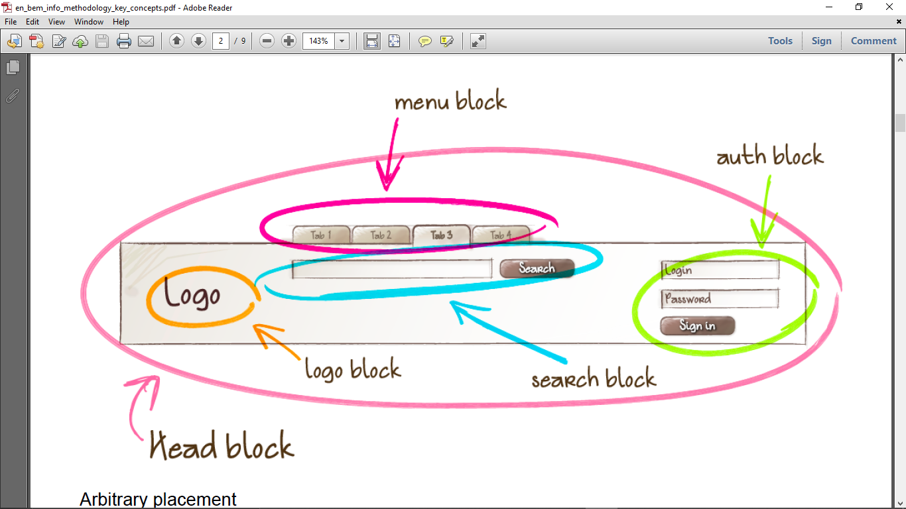
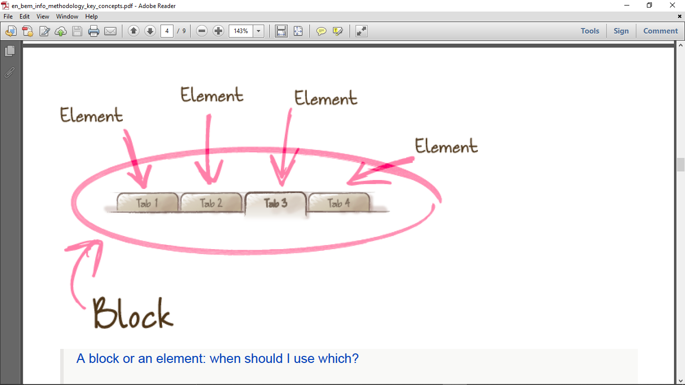

- [References](#references)
- [Introduction](#introduction)
  - [Block](#block)
  - [Element](#element)
  - [Modifier](#modifier)
- [Naming Convention](#naming-convention)
  - [Alternative Naming Schemes](#alternative-naming-schemes)

# References
> [BEM Documentation](https://en.bem.info/)

# Introduction

BEM stands for *Block-Element-Modifier*. It is a component-based approach to web development. The idea is to divide the UI into independent blocks.

Allows for reusable code across projects.

## Block
```
block-name

nav
```


Functionally independent page component that can be reused. E.g menu, nav, logo.

Blocks are represented by the `class` attribute. 

The block name should describe its purpose, not appearance. E.g `error` instead of `red-text`.

The block shouldn't influence its environment.

Blocks can be nested in each other.

Can be moved around on a page, between pages and projects.
## Element
```
block-name__element-name

nav__menu
```



Composite block that can't be used separately from it, e.g text, item, etc.

Element names should be placed to indicate a hierarchy, but separated
```html
<div class="block">
  <div class="block__elem1"></div>
  <div class="block__elem2"></div>
  <div class="block__elem3"></div>
</div>
```

An element shouldn't be used separately from the block.

## Modifier
```
block-name__element-name_modifier-name
block-name_modifier-name

/*==Alternative Naming==*/
block-name__element-name--modifier-name
block-name--modifier-name

nav__menu_vertical
nav_dark
```
An entity that defines appearance (size, theme, etc), state (how its different from others -- `disabled`, `focused`) and behaviour (how it behaves/responds to user e.g `directions_left-top`) of a block or element.

A modifier can't be used alone.

Use of modifiers is optional.

# Naming Convention

The name of a BEM entity is unique. The same entity should have the same name in all technologies - HTML, CSS, JS.

```
block__element_modifier
menu__item_visible
```

1. Names are written in lowercase
2. Words are separated by a hyphen


Identical elements in the same block have the same names.
```html
<nav>
  <ul class="nav__menu">
    <li class="nav__menu_item"></li>
    <li class="nav__menu_item"></li>
    <li class="nav__menu_item"></li>
    <li class="nav__menu_item"></li>
  </ul>
</nav>
```

## Alternative Naming Schemes
```
/*==Two Dashes==*/
block-name__element-name--modifier-name

/*==CamelCase==*/
blockName__elementName--modifierName

/*==React==*/
BlockName__ElementName--modifierName