- [References](#references)
- [Introduction](#introduction)
  - [Common CSS Terms](#common-css-terms)
  - [Anatomy of a Style](#anatomy-of-a-style)
  - [Referencing CSS](#referencing-css)
  - [Comments](#comments)
  - [CSS Resets](#css-resets)
- [Selectors](#selectors)
  - [Type Selectors](#type-selectors)
  - [Class Selectors](#class-selectors)
    - [Naming Classes](#naming-classes)
  - [ID Selectors](#id-selectors)
  - [Universal Selector](#universal-selector)
  - [Combining Selectors](#combining-selectors)
    - [Group Selectors](#group-selectors)
    - [Descendant Selectors](#descendant-selectors)
      - [Pseudo-Classes and Pseudo-Elements](#pseudo-classes-and-pseudo-elements)
        - [Pseudo-classes](#pseudo-classes)
          - [For links](#for-links)
          - [For others](#for-others)
        - [Pseudo-Elements](#pseudo-elements)
          - [For paragraphs](#for-paragraphs)
          - [For others](#for-others-1)
    - [Attribute Selectors](#attribute-selectors)
    - [Child Selectors](#child-selectors)
      - [Child Pseudo-elements](#child-pseudo-elements)
    - [SIbling Selector](#sibling-selector)
    - [The `:not()` selector](#the-not-selector)
- [Inheritance](#inheritance)
- [The Cascade](#the-cascade)
- [Specificity](#specificity)
  - [Overriding Specificity](#overriding-specificity)
- [Colors](#colors)
  - [Keyword Colors](#keyword-colors)
  - [Hexadecimal Color Notation](#hexadecimal-color-notation)
  - [RGB / RGBa](#rgb--rgba)
  - [HSL / HSLa](#hsl--hsla)
- [Measurement Values](#measurement-values)
  - [Absolute Units](#absolute-units)
    - [Pixels](#pixels)
  - [Relative Units](#relative-units)
    - [Keywords](#keywords)
    - [Percentages](#percentages)
    - [Ems](#ems)
- [Positioning](#positioning)
  - [Static Positioning](#static-positioning)
  - [Absolute positioning](#absolute-positioning)
  - [Relative Positioning](#relative-positioning)
  - [Fixed Positioning](#fixed-positioning)
  - [The `z-index` property](#the-z-index-property)
  - [The `float` property](#the-float-property)
    - [Clearing Floats `clear`](#clearing-floats-clear)
    - [Containing floats](#containing-floats)
  - [The `visibility` property](#the-visibility-property)
- [Margins, Paddings and Borders](#margins-paddings-and-borders)
  - [The Box Model](#the-box-model)
    - [The `display` property](#the-display-property)
    - [The `box-sizing` property](#the-box-sizing-property)
    - [The `width` and `height` property](#the-width-and-height-property)
    - [The `overflow` property](#the-overflow-property)
    - [The `box-shadow` property](#the-box-shadow-property)
  - [Margins](#margins)
    - [Collapsing Margins](#collapsing-margins)
  - [Padding](#padding)
  - [Borders](#borders)
- [Formatting Text](#formatting-text)
  - [Font Types/Formats](#font-typesformats)
  - [Properties](#properties)
    - [The `font-family` property](#the-font-family-property)
      - [Generic font families](#generic-font-families)
      - [Using self-hosted fonts](#using-self-hosted-fonts)
    - [The `color` property](#the-color-property)
    - [The `font-size` property](#the-font-size-property)
    - [The `font-style` property](#the-font-style-property)
    - [The `font-weight` property](#the-font-weight-property)
    - [The `font-variant` property](#the-font-variant-property)
    - [The `text-transform` property](#the-text-transform-property)
    - [The `text-decoration` property](#the-text-decoration-property)
    - [The `letter-spacing` and `word-spacing` property](#the-letter-spacing-and-word-spacing-property)
    - [The `text-shadow` property](#the-text-shadow-property)
    - [The `line-height` property](#the-line-height-property)
    - [The `text-align` property](#the-text-align-property)
    - [The `text-indent` property](#the-text-indent-property)
  - [The `font` shorthand](#the-font-shorthand)
- [Styling Links](#styling-links)
  - [Link States and Pseudo-classes](#link-states-and-pseudo-classes)
- [Backgrounds](#backgrounds)
  - [Background Colours](#background-colours)
  - [Background Images](#background-images)
    - [Background Shorthand](#background-shorthand)
    - [Using Multiple Background Images](#using-multiple-background-images)
  - [Gradient Backgrounds](#gradient-backgrounds)
    - [Linear Gradients](#linear-gradients)
    - [Repeating Linear Gradients](#repeating-linear-gradients)
    - [Radial Gradients](#radial-gradients)
    - [Repeating Radial Gradients](#repeating-radial-gradients)
    - [Conic Gradient and Repeating Conic Gradient](#conic-gradient-and-repeating-conic-gradient)
- [Styling Lists](#styling-lists)
  - [The `list-style-type` property](#the-list-style-type-property)
  - [The `list-style-position` property](#the-list-style-position-property)
- [Formatting Tables](#formatting-tables)
- [CSS Transforms, Transitions and Animations](#css-transforms-transitions-and-animations)
  - [CSS Transforms](#css-transforms)
  - [CSS Transitions](#css-transitions)
    - [The transition shorthand](#the-transition-shorthand)
  - [CSS Animations](#css-animations)
    - [The animation shorthand](#the-animation-shorthand)
- [CSS Layout](#css-layout)
  - [Fixed Width Layout](#fixed-width-layout)
  - [Fluid/Liquid Layout](#fluidliquid-layout)
  - [Responsive Web Design](#responsive-web-design)
- [Media Queries](#media-queries)
  - [Tips for Using Media Queries](#tips-for-using-media-queries)
- [CSS for Print](#css-for-print)
  - [Media Style Sheets](#media-style-sheets)
  - [Tips for Print Style sheets](#tips-for-print-style-sheets)
- [CSS Functions](#css-functions)
  - [Filter Functions](#filter-functions)
- [CSS Custom Properties (CSS Variables)](#css-custom-properties-css-variables)
- [Good Practices](#good-practices)

# References
> **Learn to Code HTML and CSS: Develop and Style Websites** by *Shay Howe*  
> 
> **CSS3: The Missing Manual** by *David Sawyer McFarland*
> 
<!-- > **Learning Web Design: A Beginner's Guide to HTML, CSS, JavaScript and Web Graphics, 4th Edition** by *Jennifer Niederst Robbins* -->
>
> CSS Functions - [W3Schools](w3schools.com), [CSS Tricks](css-tricks.com)
>
> 


# Introduction
CSS stands for *Cascading Style Sheets*. It is a presentation language created to style the appearance of content.

## Common CSS Terms
1. **Selectors**: A selector designates exactly which element or elements within our HTML to target and apply styles to. Selectors can target an id, class or a type of element.

2. **Properties**: Determines the styles that will be applied to the element targeted. Examples include `color`, `width`, etc.

3. **Values**: A value determines the behaviour of a property. 

4. **Style sheet**: A collection of CSS styles. Basically, the entire CSS file.

## Anatomy of a Style
```css
p {
  color: orange;
}

selector {
  property: value;
}
```
* `p` - selector
* `color` - property
* `orange` - value
* `p {...}` - rule set / declaration block
* `color: orange;` - declaration

## Referencing CSS
1. Inline  
    Usually placed between HTML tags. Styles only apply to that element.
    ```html
    <h1 style="color:#666;"></h1>
    ```

2. Internal Style Sheets  
    Styles are part of HTML. It always appears between `<style>` tags in the `<head>` portion.
    ```html
      <head>
        ...
      <style>
        table {border-collapse: separate; border-spacing: 0;}
      </style>
      </head>
    ```

4. External style sheet  
    Done by linking an external CSS file (a plain text file with a `.css` file extension). This file should be saved within the same folder, or a subfolder, where the HTML is located.
    Here's how an external style sheet is linked
    ```html
      <head>
        <link rel="stylesheet" href="main.css">
      </head>
    ```
    OR Using the `@import` directive
    ```html
      <head>
        ...
      <style>
        @import url (css/styles.css);
      </style>
      </head>
    ```

**Note**: Imported styles have to be placed before internal styles, and before style in an external style sheet.
```html
  <style>
    @import url (css/styles.css);
  </style>
  
  <link rel="stylesheet" href="main.css">

  <style>
    table {border-collapse: separate; border-spacing: 0;}
  </style>
```
OR

```css
/*External Style Sheet - main.css*/
@import url (css/styles.css);
....
```

```html
<!--HTML-->
<head>
  <link rel="stylesheet" href="main.css">
...
  <style>
    table {border-collapse: separate; border-spacing: 0;}
  </style>
</head>
```
## Comments
```css
/*This is a comment in CSS*/
p {color:red;}
```
## CSS Resets
Every web browser has its own default styles for different styles. CSS Resets are used to ensure cross-browser compatibility.

CSS Resets take every common HTML elements and provides a unified styles for browsers. Resets generally involve removing any sizing. margins, paddings, etc and toning these values down.


# Selectors

## Type Selectors
Tag/Type/Element Selectors.  
Target selectors by their element type.
```html
<div>...</div>
```
```css
div {...}
```

## Class Selectors
Targets an element based on the class attribute. They are more specific than type selectors - select a particular group of elements rather than all elements of one type.  
This works really well with divs and spans.
```html
<div class="awesome">...</div>
```
```css
.awesome {...}
```

### Naming Classes
1. Only letters, numbers, hyphens, and underscores in class names.
2. A class name must begin with a letter
3. Class names are case sensitive

## ID Selectors
They are more precise than class selectors; targeting only one unique element at a time.

ID attribute values can only be used once per page.

Within CSS, the id selector is denoted by a leading hash sign (#) followed by the id attribute value.

```html
<div id="id-value">...</div>
```

```css
#id-value {...}
```

## Universal Selector
The asterisk (*) is the universal selector. It selects all tags.
```css
* {
  margin: 0;
  box-sizing: border-box;
}
```

## Combining Selectors

### Group Selectors
Selecting several selectors at the same time so the same style can be applied to them.
```css
h1, h2, h3 {
  color: #1e1e1e;
}
```

### Descendant Selectors
A descendant is a tag present in another tag, no matter where it's nested. Example, the `<html>` tag is a descendant of the `<body>` tag.

```css
div p {
  font-size: 1em;
}
```

This style rule is targeting all paragraphs in divs.  
In this case, the style is read from right to left.  
The selector furthest to the right (`p`) is the *key selector*. It identifies exactly which element is being styled.  
Any selector to the left is a prequalifier.

When combining classes and ids with type selectors, there is no space between them.
```css
p.tiny {
  font-size: 0.2em;
}

span#first-time {
  color: red;
}
```

Classes and ids are separated when paired together
```css
.one .two {
  border: 1px solid black;
}

#one #two {
  background-color: #fff;
  } //This seems improper.
```

#### Pseudo-Classes and Pseudo-Elements
There are no spaces between selectors and pseudo-classes and pseudo-elements.

##### Pseudo-classes
###### For links
`:link` selects links that haven't been visited yet, while the mouse isn't hovering over or clicking it. 

`:visited` selects links that have been visited before, according to browser history.

`:hover` selects links that are being hovered on. Can be used other elements apart from links.

`:active` determines how a link looks as its being clicked. 

###### For others
`:focus` is similar to `:hover `. It applies when the visitor does something to indicate their attention to a web page, e.g clicking or tabbing.  
USeful for giving visitors feedback. Particularly useful with forms.

##### Pseudo-Elements
Syntax was changed from `:` to `::` but single colon still permitted for backward compatibility.

###### For paragraphs
`::first-letter`

`::first-line`

###### For others
`::before` lets you add content preceding an element.

`::after` adds generated content after an element.

`::selection` refers to elements that have been selected on a page.  
Can only set `color` and `background-color` with this pseudo-element.  
There is no single colon version of this pseudo-element.

`::first-child`

`::last-child`

`::nth-child` - More in child [pseudo-elements](##child-pseudo-elements)

`:first-of-type`

`:last-of-type`

`:nth-of-type`


### Attribute Selectors
```css
selector[attribute]

/*For elements with a particular attribute*/
a[title] {
  color: red;
}

/*For elements with a specific value for an attribute*/
a[href="..."] {
  color: red;
}

/*For elements with attributes that begin with a particular phrase. Doesn't work for secure connections*/
a[href^="http://"] {
  color: pink;
}

/*For elements with attributes that contain a particular phrase.*/
a[href*="image"]
```

### Child Selectors
A child is a tag that is directly nested in another tag.
```css
p > span {...}
```
#### Child Pseudo-elements

`::first-child`

`::last-child`

`::nth-child`
```css
/*Select alternating odd children elements*/
div:nth-child(odd)

/*Select alternating even children elements*/
div:nth-child(even)

/*Select every third element*/
div:nth-child(3n)

/*Select every fifth element starting from the second child element*/
div:nth-child(5n+2)
```
### SIbling Selector
Siblings are elements that come right after each other, not nested in each other.
```css
/*Adjacent Sibling*/
h1 + p {...}

/*General Siblings*/
h1 ~ p {...}
```
### The `:not()` selector
Called the negation pseudo-class.  
Used to exclude a tag from a general style.
```css
p:not(.sentence-one) {...}
```

1. Can't be used with descendant selectors, pseudo-elements, group selectors or combinators.


# Inheritance
Descendants inherit properties from ancestors.  

Doesn't just apply to tag styles. Also, class styles, ID styles, etc.

Some CSS properties are not inherited. Examples are `border`, `vertical-align`, `white-space`, `margin`, `padding`, etc.

# The Cascade
The cascade governs how styles interact and which styles get precedence when there's a conflict.

The cascade is a set of rules for determining which style properties get applied to an element. It specifies how a web browser should handle multiple styles when applied to the same tag and what to do when CSS properties conflict.

1. The last style applied to a tag based on its position on the style sheet is the one implemented. All styles cascade from the top of the style sheet to the bottom.
  ```css
  p {color:orange;}
  ...
  p {color:green;}
  /*The paragraph will be green*/
  ```

2. The most specific style is applied to the element
  ```css
  .paragraph {color:orange;}
  ...
  p {color:green;}
  /*The paragraph will be orange*/
  ```

# Specificity
Every selector has a specificity weight. A selector's specificity weight coupled with its placement in the cascade identifies how styles will be rendered.

In order of importance: 
**Inline Style - ID - Class - Type**

The higher the specificity weight of a selector, the more superiority it is given when a conflict occurs.

## Overriding Specificity
Using the `!important` tag
  ```css
  p {color:orange !important;} 
  ...
  p {color:green;}
  /*The paragraph will be orange*/
  ```

**Note**
1. `!important` only works on individual properties, not entire styles.
2. When two styles have `!important` tag, the more specific style wins.


# Colors

## Keyword Colors
These values are just the names of the colors you intend to use. Most common colors have keywords, and a few weird ones.  
Colors have to be part of CSS recommendations.

```css
p {
  color: black;
}
```

## Hexadecimal Color Notation
Oldest color system used by web designers.
Example: `#6600FF` contains three hexadecimal numbers.
`66` - represents red channel
`00` - represents green channel
`FF` - represents blue channel

The figures go from *0-9*, and the letters go from *a-f*. There are over 16.7 million hexadecimal colors.

The final color value is a blend of the amounts of red, green and blue specified.

```
#6600FF
#RRGGBB
```

Can be shortened to three characters if each set contains the same two numbers. Example:
```
#6600FF -----> #60F

#FFFFFF -----> #FFF
```


## RGB / RGBa
Color value consists of three numbers for each hue (red, green and blue).

The numbers can be from **0-255** or in percentages from **0-100**.
```css
p {
color: rgb(255,255,255); /*White*/
}

p {
color: rgb(100%, 100%, 100%); /*white*/
}
```

The *a* in RGBa stands for alpha. It controls transparency / level of opacity. It accepts values between 0 and 1.  
`0` is totally opaque, and `1` is invisible.
```css
p {
color: rgb(255,255,255,0.72); /*White*/
}

p {
color: rgb(100%, 100%, 100%, 0.5); /*white*/
}
```

## HSL / HSLa
```css
p {
  color: hsl(0, 100%, 50%); /*Bright red*/
}
```

HSL stands for hue, saturation and lightness/luminance. 

First value, *hue* is in degrees from *0-360*, which maps to a circle of hues. Think ROYGBIV.  
Each color is separated by around *51 degrees*. 
* red - 0, 360  
* yellow - around 50  
* orange - 100  
* green - 150, etc.

The second value is the *saturation*, or how pure the color is. Specified in percentages.
* 0% - dull gray (no matter the hue)
* 100% - pure colour (bright and vibrant)


The third value is the *lightness*, specified in percentages.
* 0% - completely black
* 100% - completely white
* 50% - pure colour


It also has an alpha channel, and supports opacity.
```css
p {
  color: hsla(0, 100%, 50%, 0.3); /*Bright red*/
}
```

# Measurement Values
These are the values used when indicating length, width or size in CSS.

## Absolute Units
Absolute units are best used for the print style sheets.

### Pixels
Essentially, a pixel in CSS is supposed to match to a pixel on a screen. That isn't necessarily the case.

Equal to 1/96 of an inch.

```css
div {
  border-width: 1px;
}
```

**Other absolute units include**
* `pt` - points; 1/72 inch
* `pc` - picas; equal to 12 points
* `mm`
* `cm`
* `in`

## Relative Units

### Keywords
`font-size: x-small;`

1. xx-small
2. x-small
3. small
4. medium: same as base size.
5. large
6. x-large
7. xx-large
8. larger
9. smaller

### Percentages
`font-size: 100%;`

Usually relative to the parent element OR base (font) size.
* 100% - base size

### Ems
In typography, `em` refers to the size of a capital *M* for a particular font.

In CSS, it is calculated based on element's font size.
**1 em = 100%**

For consistency, set body `width` to 100% when using ems. Mind the nesting.

**Other relative units include**
* `ex` - x-height; relative to height of lowercase *x*
* `ch` - zero width; equal to width of zero
* `vw` - viewport width unit
* `vh` - viewport height unit
* `vm` - viewport minimum unit
* `rem` - root em; relative to em size of root element (html)

**Note**: You can also use negative values.

# Positioning
The `position` property lets you control how and where a browser displays elements. The default value is `static`.

## Static Positioning
Default value of `position` property. Content follows HTML flow.

## Absolute positioning
`position: absolute;`

Works in hand with `left`, `right`, `top` and `bottom` properties, which accept values in *[measurement values](#measurement-values)*.

Absolutely positioned elements are completely detached from the page flow. The space where it should be isn't kept. They can be placed relative to the browser window or the containing element if it is made `relative`.

## Relative Positioning
`position: relative;`

Placed relative to current position in page flow. Also works in hand with `left`, `right`, `top` and `bottom` properties.

It leaves the space where the element should have been. 

## Fixed Positioning
Locked into place on the screen. Doesn't scroll.

## The `z-index` property
Determines the order in which positioned elements are stacked on each other. 

The larger the value, the closer to the top the element appears.

Can accept negative values. Can use really large numbers, but some browsers have a limit of 2147483647.

## The `float` property
Moves an element to the left or right. Content below the floated element wraps around it.  Depends on the element being a block element, and may alter the display value if it's not.

The element is removed from normal flow.
`left`  
`right`
`none`

### Clearing Floats `clear`
To prevent content from wrapping. The `clear` property is applied to the element after the floated element.

### Containing floats
Similar results to clearing floats, but ensures that styles render properly.

To contain floats, the floated elements must reside in a parent element.

```css
/*Clearfix*/
.parent:before,
.parent:after {
content: "";
display: table;
}

.parent:after {
clear: both;
}

.parent {
clear: both;
*zoom: 1;
} 
```

`left`  
`right` 
`both`  
`none`

## The `visibility` property
Lets you hide part of a page. Accepts two values - `visible` and `hidden`. The `hidden` value is similar to `display:none;` but leaves the space.

# Margins, Paddings and Borders

## The Box Model
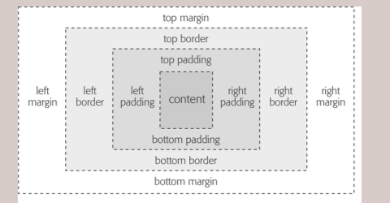

**Padding**: The space between the content and the content's border.

**Border**: Line drawn around each edge of the box. Sits between the padding and margin.

**Margin**: Space that separates one element from another. This space is called a *gutter*.

### The `display` property
Determines how an element will be displayed
`inline` `inline-block` `block` `none`


**Accepted values:** inline|block|list-item|inline-block|table|inline-table|
table-row-group|table-header-group|table-footer-group|table-row|
table-column-group|table-column|table-cell|table-caption|none

### The `box-sizing` property
1. `content-box`
2. `border-box`

When set to `content-box`, the width and height values are applied to the content box. The padding, margin and borders are added on after that. This is the default value.

When set to `border-box`, the width and height values include the padding, margin and borders.

### The `width` and `height` property
Can only be specified for block-level elements and non-text inline elements.

*  `height`
*  `width`
*  `max-height`
*  `min-height`
*  `max-width`
*  `min-width`

### The `overflow` property
Specifies what to do when content doesn't fit
1. `visible`
2. `hidden`
3. `scroll`
4. `auto`
5. `inherit`

When set to `auto`, the browser decides. Usually scroll.

Accepts [measurement values](#measurement-values)

### The `box-shadow` property
Applied similarly to [`text-shadow`](#the-text-shadow-property) property. Optional values include:
```css
box-shadow: (inset) vertical-offset horizontal-offset shadow-radius (spread) shadow-color;

box-shadow: inset 4px 3px 2px 1px black;
```
The `inset` keyword tells a browser to draw the shadow inside the box.

The `spread` expands the shadow by the specified amount.

## Margins
Uses *[measurement](#measurement-values)* values.
```css
margin-right: 0px; /*Applies to all sides*/
margin-left: 0px;
margin-top: 0px;
margin-bottom: 0px;/*Don't need to add the px*/

/*Shorthand*/
margin: top right bottom left;
margin: top|bottom left|right;
margin: top left|right bottom;
```

### Collapsing Margins
When two margins collide, the browser applies the larger margin.  
To prevent this, use top or bottom padding instead or add a border.  
Left and right margins don't collapse.

## Padding
Uses *[measurement](#measurement-values)* values.
```css
padding-right: 0px; /*Applies to all sides*/
padding-left: 0px;
padding-top: 0px;
padding-bottom: 0px;/*Don't need to add the px*/

/*Shorthand*/
padding: top right bottom left;
padding: top|bottom left|right;
padding: top left|right bottom;
```

## Borders
Has three main properties; `border-color`, `border-width` and `border-style`.
```css
border: width style color;
border: 1px solid black;

border-top: 1px solid black;
border-bottom: 1px solid black;
border-left: 1px solid black;
border-right: 1px solid black;
```
The `border-width` property accepts
* Measurement values, except percentages.
* Keywords - `thin`, `medium` and `thick`.

The `border-style` controls the type of line drawn. Accepts keywords like
* `solid`
* `dotted`
* `dashed`
* `double`
* `groove`
* `ridge`
* `inset`
* `outset`
* `none`
* `hidden`  
* `inherit`  
`None` and `hidden` work the same way; removing the border completely.
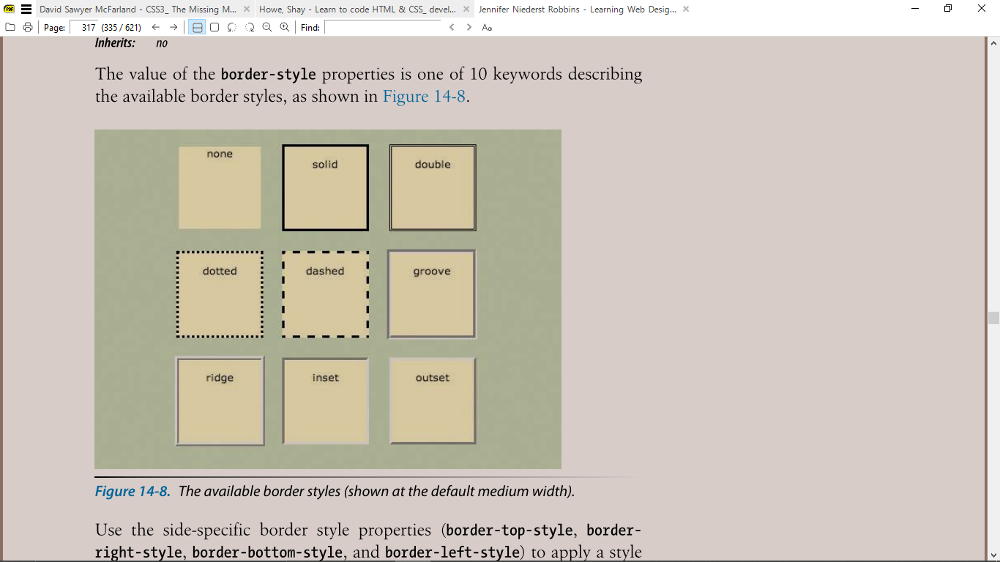

The `border-radius` property lets you curve the radius of the element. Applied similarly to padding and margin. Other applications include:
```css
border-radius: horizontal-radius/vertical-radius;
border-radius: top-left top-right bottom-right bottom-left;

border-radius: 40px/20px;
border-radius: 40px/20px 10px/30px 20px/40px 10px;
```
* `border-top-left-radius`
* `border-top-right-radius`
* `border-bottom-left-radius`
* `border-bottom-right-radius`

The `border-color` property sets the color for the border. 
`border-top-color` `border-right-color` `border-bottom-color` `border-left-color`
```css
border-color: top right bottom left;
```

THe `border-image` property lets you set an image as the border.
```css
border-image: image-source image-slice image-width image-outset image-repeat;

border-image: url(img.png) 33 33 33 33 stretch;
```
`border-image-slice` provides measurements to the four slice lines that divide the image into nine sections. The 33 numbers.  
`border-image-outset` specifies the distance for the image to hang out over the border.  
`border-image-repeat` specifies how the image should fill in the sides - stretch, round or repeat.


# Formatting Text
A *typeface* is what we see; the artistic impression of how text looks, feels and reads.

A *font* is a file that contains a typeface.

## Font Types/Formats
1. **Embedded Open Type(EOT)**
Work only in Internet Explorer. 

2. **True Type(`.ttf` ** and **Open Type(`.otf`)**
Most commonly used formats. Has wide support in web browsers.  
Can also be used for word processing.

3. **Web Open Font Format `.woff`**
Designed specifically for the web. Basically compressed versions of `.ttf` and `.otf`.

Generally smaller in size and download quicker. Have wide browser support.

4. **Scalable Vector Graphic `.svg`**
Not actually a font format. Support for svg fonts is limited.  
File sizes are large. Only format understood by older Safari versions.

**Note**: A single font file contains just one weight and style. So each variation has to be downloaded if we're using web fonts.


## Properties
### The `font-family` property  
The `font-family` property specifies the font to be used.
```css
p {
  font-family: Arial;
}

p {
  font-family: "Helvetica Neue", Helvetica, Arial, sans-serif;
  /*The sans-serif is a generic font family. The browser gets to chose the actual font*/
}
```
To use a font, the visitor must have it installed on their computer. In case the font isn't present, fallbacks are created.  
The browser uses the first font it discovers the computer has.  
Font names consisting of two or more words have to be wrapped in quotation marks.

#### Generic font families
1. **Serif fonts**  
Best for long passages of text. It is believed that the 'serifs' gently lead the eye from letter to letter, making text easier to read.

Examples are Times New Roman, Times, Georgia.

2. **Sans-serif fonts**  
Used for headlines. Clean, simple appearance.

Examples are Arial, Helvetica, Verdana.


3. **Monospace fonts**  
Used to display computer code. Each letter is the same width. 


#### Using self-hosted fonts
Have to use the `@font-face` directive.
```css
@font-face {
  font-family: "League Gothic";
  src: url('fonts/League_Gothic_font.eot');
  src: url('fonts/League_Gothic_font.eot?#iefix') format('embedded-opentype'),/*For IE9 Compability Mode*/
  src: url('fonts/League_Gothic_font.woof') format('woff'),
  src: url('fonts/League_Gothic_font.ttf') format('truetype'),
  src: url('fonts/League_Gothic_font.svg') format('svg');
}

p {
  font-family: "League Gothic";
}
```

### The `color` property  
Changes the color of the text. Uses color values.  
*See [colors](#colors).*


### The `font-size` property  
Sets text size. Accepts measurement values.  
*See [measurement values](#measurement-values).*

Base text size should be 16px but to be on the safe side, set it to the root element or the body element.

For keywords, using 16px as base font size.

1. xx-small = 9px
2. x-small = 10px
3. small = 13px
4. medium: same as base font size.
5. large = 18px
6. x-large = 24px
7. xx-large = 32px
8. larger
9. smaller

### The `font-style` property  
```css
p {
font-style: normal/oblique/italic/inherit;
}
```

Oblique is identical to italic; also a slanted version of a font.  
The difference is:  
*Italic* is usually a separate typeface design with curved letter forms.  
**WHILE** *oblique* takes the normal font design and just slants it.

### The `font-weight` property  
Specifies if a font is bold or not, or the specific weight it should have.

1. **Keyword values** - normal, bold, bolder, lighter, inherit
2. **Numeric values** - 100-900 (normal - 400, bold - 700)

### The `font-variant` property
Switches types faces between variants.
1. `small-caps`
2. `inherit`
3. `normal`  

### The `text-transform` property
Change case of text  
1. `uppercase`
2. `lowercase`
3. `capitalize`
4. `none`
5. `inherit`

### The `text-decoration` property
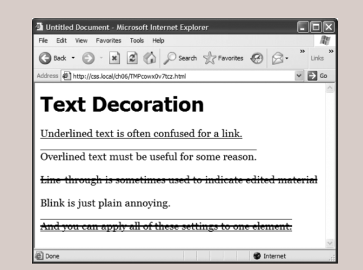
1. `underline`
2. `overline`
3. `line-through`
4. `blink` - makes text blink
5. `none`

You can combine multiple keywords for multiple effects
```css
text-decoration: underline overline;
```

### The `letter-spacing` and `word-spacing` property
Controls spacing between words and letters respectively.
Uses measurement values.
See *[measurement](#measurement-values)*

Note:  
Space between letters is called *tracking*.

### The `text-shadow` property
Lets you add drop shadows to text.
```css
text-shadow: horizontal-offset vertical-offset blur color;

text-shadow: -4px 4px 3px #999;
```

1. **Horizontal offset**  
How far to the left or right of the text the shadow should appear.
Negative values (-4px) make the shadow appear on the left, and positive values on the right.

2. **Vertical offset**  
How far above or below the text the shadow should appear.
Negative values make the shadow above the text, and positive values below.

3. **Blur**  
How blurry the shadow is.

### The `line-height` property
Adjust the space between lines. Uses *[measurement](#measurement-values)* values.

Percentage values are relative to `font-size`.

Normal `line-height` setting for a browser is 120%.

Note:  
To determine the amount of space that appears between lines of text, the browser subtracts the font size from the line height.  
The result - *leading* is the amount of space between lines in a paragraph.

You could also specify line height with just a number.
```css
line-height: 1.5;
```
The browser multiplied this number by the font size to determine the line height.

### The `text-align` property
Aligns text.

1. `left`
2. `right`
3. `justify`
4. `center`

### The `text-indent` property
Used to create a space between the text and the edge, to indicate a paragraph. Accepts *[measurement](#measurement-values)* values.

## The `font` shorthand
```css
font: style variant weight size/line-height font-family;

font: italic small-caps bold 14px/22px "Helevetica Neue", Helvetica, Arial, sans-serif;

/*Can omit some, but must include font-family and font-size*/
font: 14px "Helevetica Neue", Helvetica, Arial, sans-serif;

/*Font size must come before font family, at the end. The rest can be arranged in any order*/
font: italic bold small-caps 14px Arial;
font: bold small-caps italic 14px Arial;

/*Omitting a value form a list is the same as setting it to normal*/
font: 1.5em Arial; /*The other properties are set to normal and won't be inherited*/
```

# Styling Links

## Link States and Pseudo-classes
* `:link ` - unvisited link
* `:visited` 
* `:hover`
* `:active` - link being clicked
* `:focus`  
See *[pseudo-classes](#pseudo-classes)* and *[attribute selectors](#attribute-selectors)* for more information

To design all the different states, it must be in this order - **L-V-H-A**

# Backgrounds
## Background Colours
Uses the `background-color` property. Accepts color values, `transparent` and `inherit`.

The `opacity` property is used to make elements transparent. Accepts numbers from `0-1`. Works like the alpha channel on RGBa colours.

## Background Images
Uses the `background-image` property
```css
background-image: url(img/image.png);
```

The `background-repeat` property controls how or if an image tiles. It accepts four values:
* `repeat`
* `no-repeat`
* `repeat-x`
* `repeat-y`

The `background-position` property is used to control the placement of the image. You can specify using *keywords, exact values, and percentages*.  
**Using keywords**
1. Horizontal positions - `left` `center` `right`
2. Vertical positions - `top` `center` `bottom`

```css
background-position: horizontal vertical;
background-position: right bottom;
background-position: 5px 8px;
background-position: 50% 50%;
```

The `background-attachment` property decides if a background image moves with the text or stays in place. Accepts the following values
1. `fixed`
2. `scroll`(default)
3. `local`

The `background-origin` property determines the starting-point of the image. Background images typically start from the upper-left corner of whatever area is decided. It accepts
* `border-box`
* `padding-box` (default)
* `content-box`

The `background-clip` property limits a background to a certain region. It accepts the same values as `background-origin`.

The `background-size ` resizes background images. It accepts [measurement values](#measurement-values).
`background-size: width height;`  
It also accepts keywords
* `auto` - browsers resizes to maintain aspect ratio
* `contain` - forces image eo fit while maintaining aspect ratio
* `cover` - forces element to fill width and height of containing element.

### Background Shorthand
```css
background: image position repeat attachment color;

background: url(icon.png) center center no-repeat fixed #fff;
background: #fff; /*Just white*/
```

### Using Multiple Background Images
```css
background-image: url(image1.jpg), url(image2.jpg), url(image3.jpg);
background-repeat: no-repeat, no-repeat, repeat-y;

/*Shorthand*/
background: url(image1.jpg) center top no-repeat,
            url(image2.jpg) center bottom no-repeat,
            url(image3.jpg) center top repeat-y;
```

## Gradient Backgrounds
For smooth gradients, the starting colour should also be the end colour.  
Because browsers treat gradients as background images, other background properties can also be applied.  
You can mix images and gradients.

### Linear Gradients
```css
background-image: linear-gradient(starting-position start-colour, (middle-colour), end-colour);

background-image: linear-gradient(top left yellow,black, white);
background-image: linear-gradient(45deg yellow,black, white);

/*Applying Color Stops*/
/*Start black at 10%, begin white at 90%*/
background-image: linear-gradient(top left yellow ,black 10%, white 90%, yellow);
background-image: linear-gradient(top left yellow ,black 10px, white 90px, yellow);

```

The starting-position accepts values like `background-position`. It also accepts values in degrees.

### Repeating Linear Gradients
```css
background-image: repeating-linear-gradient(top left yellow ,black 10px, white 90px, yellow);
```

### Radial Gradients
Gradients that radiate outward in a circular or elliptical pattern
```css
background-image: radial-gradient(yellow,black, white);
background-image: radial-gradient(circle, yellow,black, white);

/*Positioning is for the center of the gradient*/
background-image: radial-gradient(20% 40%, circle, yellow,black, white);

/*Dictating gradient size*/
background-image: radial-gradient(20% 40%, circle (sizing), yellow,black, white);
background-image: radial-gradient(20% 40%, circle closest-side, yellow,black, white);
```

For gradient size, keywords are used and they include;
1. `closest-side` - Gradient extends from center as far as the side closest to the center.
2. `closest-corner` - Measures width of gradient from center to closest corner of element.
3. `farthest-side`
4. `farthest-corner`
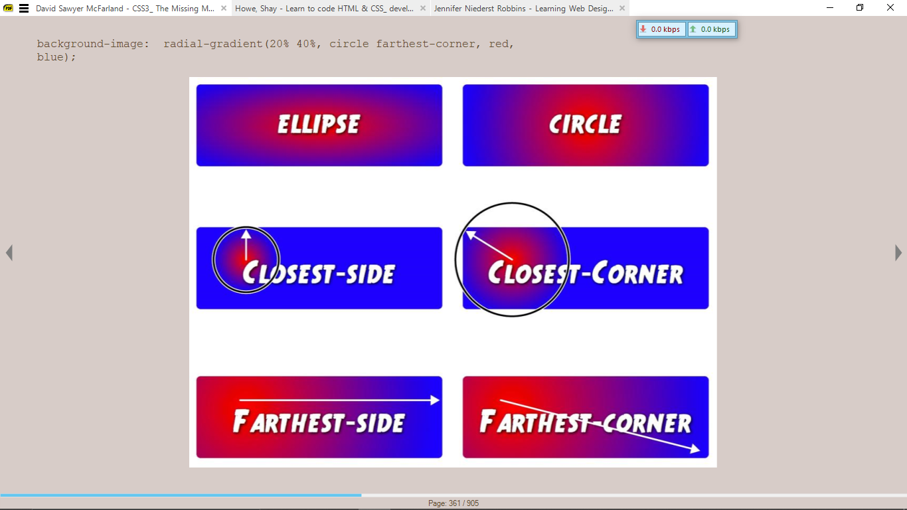

### Repeating Radial Gradients
```css
background-image: radial-gradient(circle, yellow 20px,black 30px, white 40px);
```

### Conic Gradient and Repeating Conic Gradient

# Styling Lists

## The `list-style-type` property
Decides the type of bullets for unordered lists, and the numbering scheme for ordered lists
**Bullets**
1. `disc`
2. `circle`
3. `square`

**Numbering Schemes**
1. `decimal`
2. `decimal-leading-zero`
3. `upper-alpha`
4. `lower-alpha`
5. `upper-roman`
6. `lower-roman`
7. `lower-greek`, etc.

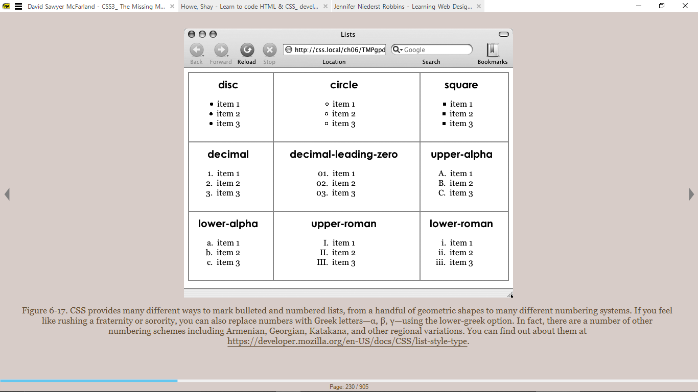

## The `list-style-position` property
1. `inside`
2. `outside`

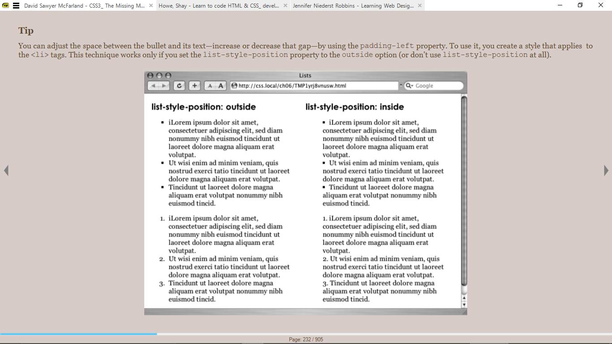

**Tip:**  
You can adjust the space between the bullet and text by increasing the `padding-left` property. Works only if `list-style-position` is set to `outside` or don't use it at all.

You could also use an image instead with the `list-style-image` property.

# Formatting Tables
Padding cannot be used with the `<table>` tag, but with cells.

Text-align controls horizontal positioning. It is inherited.

Vertical-align aligns content vertically. It is not inherited.

The `border-collapse` property is used to eliminate double borders. It accepts two values - `collapse` and `separate`.  
When set to `collapse`, border-spacing has  o effect.

# CSS Transforms, Transitions and Animations

## CSS Transforms
Used for rotating, scaling, moving, skewing. Transformations can be combined.
```css
/*Rotation*/
transform: rotate(10deg);

/*Scaling*/
transform: scale(X, Y);
transform: scale(2); /*x2*/
transform: scale(0.5); /*x0.5*/
transform: scaleX(3);
transform: scaleY(0.35);
transform: scaleZ(0.35);
transform: scale3d(); /*Not yet sure how it works*/

/*Translate*/
transform: translate(X, Y);
transform: translateX(10em);
transform: translateY(-5px);
transform: translateZ(5px);
transform: translate3d(); /*Not yet sure how it works*/


/*Skew*/
transform: skew(X, Y);
transform: skewX(10deg);
transform: skewY(-5deg);

/*Applying Multiple Transformations*/
transform: skew(45deg, 0deg) scale(.5) translate(40px, 50em) rotate(90deg);

/*Transform Origin*/
transform-origin: X Y;
```
CSS Transforms don't affect other elements around so there might be an overlap.

The `rotate` function accepts values in degrees - 0 to 360. A positive number of degrees is applied clockwise, and a negative number is applied anti-clockwise.
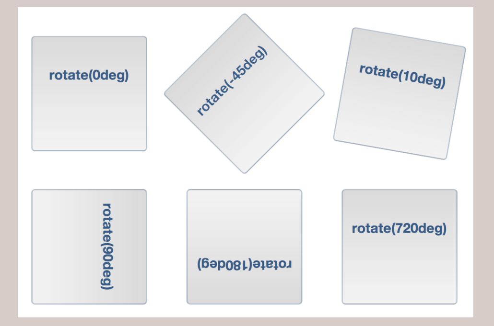

The `scale` function resizes an element, making it bigger or smaller. It accepts number values which is the *scaling factor*.  
A value of 0 renders the element invisible. Everything in the scaled element is enlarged or reduced.  
A negative value flips the element. It can only be flipped on one axis, and produces a mirror effect.
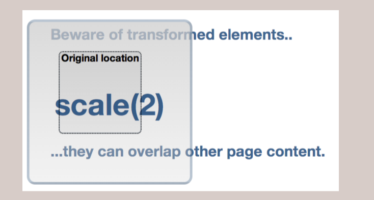

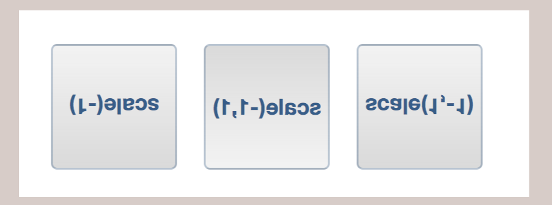


The `translate` function moves an element from its current position a set amount left or right and up or down. It leaves an empty space where the element should be.  
Negative values move to the left or up, positive values to the right or down.
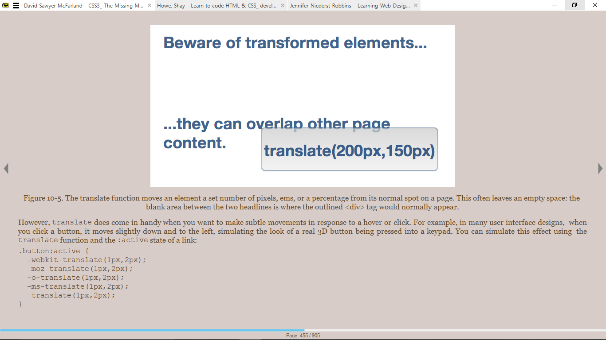

The `skew` function lets you slant an element on its horizontal and vertical axes. It accepts values in degrees.  
Negative values are applied anti-clockwise.
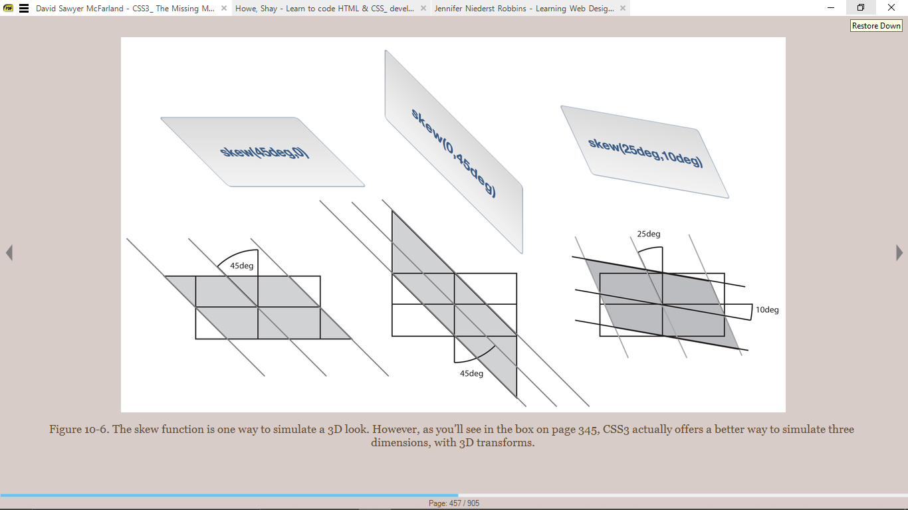

When applying multiple transformations, the browser applies the effect in the order they are specified. 

The `transform-origin` property lets you change the transformation point. The default position is the center of the element. It works like the *[background-position](#background-images)* property.  
It has no effect on elements moved using only the `translate` function.

***Note: There are also 3-d transforms in CSS***
## CSS Transitions
Transitions are simply animations from one set of CSS properties to another set over a specific amount of time. There are basically animations that iterate once.

```css
.button {
  background-color: red;
  transition-property: background-color;
  transition-duration: 1s;
}

.button:hover {
  background-color: blue;
}
```

The `transition-property` specifies which properties to animate. The keyword `all` can be used to animate all CSS properties that can change.
```css
transition-property: color, background-color, border-colour;
transition-property: all;
```

The `transition-duration` property specifies how long the animation takes to complete. It takes values in seconds or milliseconds.
```css
transition-duration: 1s;
transition-duration: 1000ms;

/*Setting durations for several properties at a time*/
transition-property: color, background-color, border-colour;
transition-duration: 1s, 2s, 3s;
```

The `transition-timing-function` property controls the speed during the animation. For example, the animation can begin slowly then quickly get completed but still within the specified duration.  
The keywords used are
* `linear` - steady change along the entire length of the animation.
* `ease` (default) - Begins slowly, speeds up in the middle and slows down in the end.
* `ease-in` - starts slowly, then speeds up
* `ease-out` - starts fast, then slows down
* `ease-in-out` - similar to `ease`, but with less pronounced acceleration in the middle
* `step-start` 
* `step-end`
* `steps`
* `cubic-bezier(#,#,#,#)` - plots the progress of the animation over time.

The `transition-delay` property prevents a transition from animating immediately its triggered. Accepts values in seconds and milliseconds.

### The transition shorthand
```css
transition: property duration (timing-function) (delay);
transition: all 1s ease-in .3s;

transition: color 1s, background-color 2s;
```

## CSS Animations
Lets you animate from one set of properties to another. They do not necessarily need a trigger.
Animations, have similar functions as transition such as timing-function, duration, etc. Timing function can be controlled between keyframes.

The first step is to create a set of keyframes. A *keyframe* is a single frame of an animation that dictates how a scene looks. The browser fills in the gaps between frames.
```css
@keyframes animationName {
  from {
    /*First set of CSS properties*/
  }
  to {
    /*Second set of CSS properties*/
  }
}

@keyframes animationName {
  from {
    opacity: 0;
  }
  to {
    opacity: 1;
  }
}

@keyframes animationName {
  from/0% {
    color: white;
  }
  50% {
    color: gray;
  }
  to/100% {
    color: black;
  }
}

@keyframes animationName {
  from {
    color: yellow;
    animation-timing-function: linear;
  }
  25%, 75% {
    color: blue;/*Color stays at blue from 25% to 75%*/
    animation-timing-function: ease-in;
  }
  to {
    color: red;
    animation-timing-function: ease-out;
  }
}
```

```css
/*Applying animations to an element*/
div {
  animation-name: animationName;
  animation-duration: 1s;
}

/*Applying multiple animations to an element*/
animation-name: animationName-one animationName-two;
animation-duration: 1s, 2s;
```

The `animation-iteration-count` property indicates how many times an animation iterates. It accepts number values and one keyword - `infinite`.

The `animation-direction` property accepts the `alternate` keyword which specifies that when the animation is done, it reverses before iterating again. An even number of iterations with an `alternate` direction ends at the beginning.

The `animation-fill-mode` property decides if the element return to its initial conditions before animation or remains at the end state.
This property accepts keywords
* `forwards` - remain at end state 

The `animation-play-state` controls an animation's playback. Usually applied with pseudo-classes. Accepts two keywords
* `running`
* `paused`

### The animation shorthand
```css
animation: name duration [timing-function iteration-count direction delay fill-mode];
```

# CSS Layout
## Fixed Width Layout
Regardless of browser width, the page content's width remains the same. 

FOr a fixed width layout, you have to decide
1. The width, based on common monitor resolutions. - Usually 960px or 1024x768.
2. Where the layout should be positioned; left, right or center.
  
## Fluid/Liquid Layout
Adjusts to fit the browser's width. Use percentage values instead of absolute values.


## Responsive Web Design
Championed by *Ethan Marcotte*. Operate like liquid layouts, but use media queries to send different designs to different-width browsers.

# Media Queries
Media Queries let you assign styles to a page based on the destination browser's width and height.

Used to create custom styles for different devices.

Common breakpoints for media queries are for smartphones, tablets and desktop monitors.

See [media style sheets](#media-style-sheets)
```css
@media (min-width: ...) and (max-width: ...) {
  body {
    width: 100%;
  }
}
```
## Tips for Using Media Queries
1. **Adjust columns**: Either reduce or remove for smaller screens. Avoid floats.
2. **Use flexible widths** for smaller screens. Can stick to fixed-width for desktop.
3. Tighten up white space
4. Adjust font sizes
5. Change navigation menus
6. Hide content on hand-held devices, if necessary.
7. Use background images


# CSS for Print

## Media Style Sheets
Style sheets that let you create styles for a particular media type.
1. **all** - applies to every type of device
2. braille
3. embossed
4. handheld
5. **print** styles apply only when page is printed/
6. projection
7. **screen** refers to styles displayed only on a monitor.
8. speech
9. tty
10. tv

```html
<!--How to attach media style sheets from external style sheets in HTML-->
<link rel="stylesheet" href="print.css" media="print">

OR
@import url(print.css) print; <!--Doesn't work for IE8 and earlier>
```

```css
/*==Specify print style in style sheet==*/
@ media print {
...
}
```

## Tips for Print Style sheets
1. Remove background elements
2. Hide unwanted page areas
3. Show actual links instead of linked text

# CSS Functions
1. `attr()`
    Returns the value of an attribute of the selected element
    ```html
    <div data-example="foo">
    ```
    ```css
    div {
      content: attr(data-example);
    }
    ```

2. `calc()`
    Allows you perform calculations to determine property values in CSS

3. `counter()`
    Returns the current value of the named counter

4. `max()`
    Uses the largest value, from a comma-separated list of values, as the property value

5. `min()`
    Uses the smallest value, from a comma-separated list of values, as the property value

## Filter Functions
> Check [CSSGram](https://una.im/CSSgram/) for examples
They only work with the `filter` property. 

Filters are special effects applied to an element, mimicking capabilities of graphic editing programs.

The `brightness()` function adjusts how bright an object appears. At low levels, appears like a shadow has been cast over the object. At high levels, looks like an over-exposed photo.
```css
.avatar:hover {
  filter: brightness(150%);
}
```

The `blur()` function applies a blur on the objects.

The `contrast()` function adjusts the degree of difference between the lightest and darkest parts of the object it is applied to.

The `grayscale()` function removes color information from the object; makes it black and white. A partial grayscale can be applied however to make an object look weathered or washed out.

The `invert()` function makes something look like a photo negative.

# CSS Custom Properties (CSS Variables)
Uses the `var()` function. USually declared at the root element.

```css
html {
  --color: orange;
}

p {
  color: var(--color);
}
```
# Good Practices
1. Adding Comments
Helpful as reminders, and for others using your code. *See [comments](#comments)*

1. Name Styles Clearly
Name styles by purpose, not appearance. E.g `.error` or `alert` not `.redhighlight`. The name should make sense even if the style changes.

1. Don't use names based on position. E.g `.secondaryContent` instead of `.leftSidebar`.

2. Avoid cryptic names e.g `s1`, `s2`

3. Use multiple classes to save time

4. Organize styles by grouping
Group styles related to parts of a page. For example, all rules that apply to text, graphics, links placed in one place.  
Group styles with a related purpose e.g typography, links, etc.

1. Use comments to separate style groups

2. Consider using multiple style sheets.

3. Consider Resets - removing paddings and margins, consistent font sizes, displaying HTML5 elements as block elements, etc.

4.  Use descendant selectors where you can, to prevent specificity issues with IDs and classes

5.  Compartmentalize your pages

6.  Identify the body; add a class or ID. Useful for sites with multiple pages.

7.  Remove the units from any zero value, e.g 0 instead of 0px.


