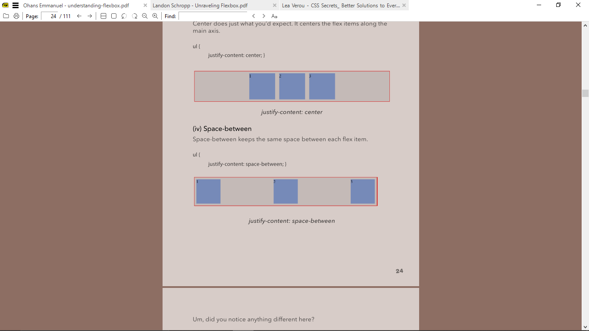
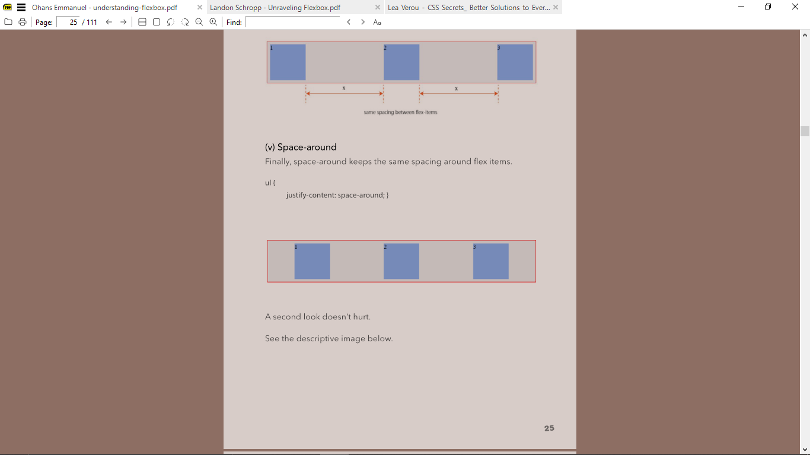
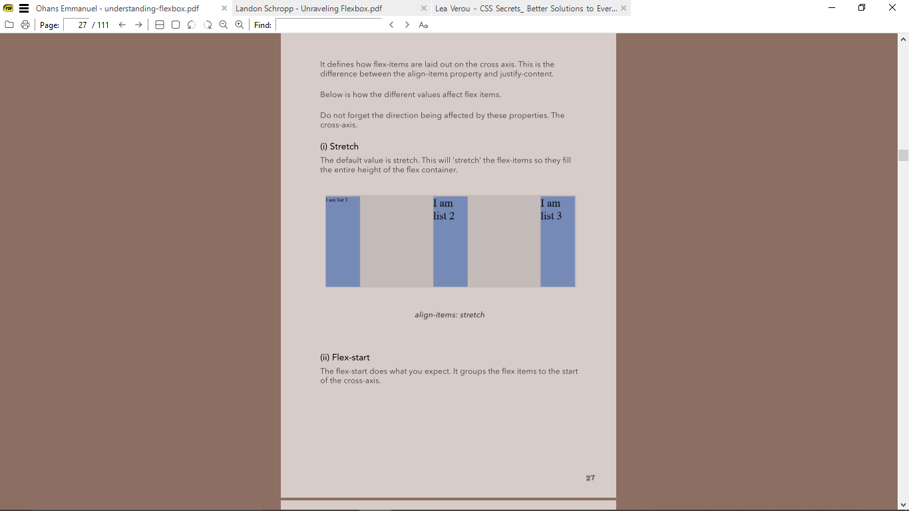
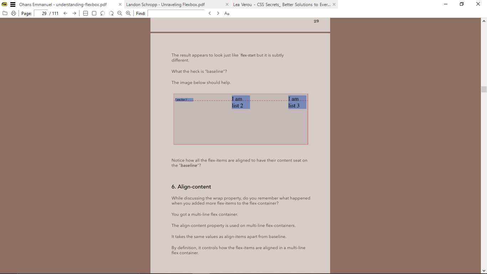
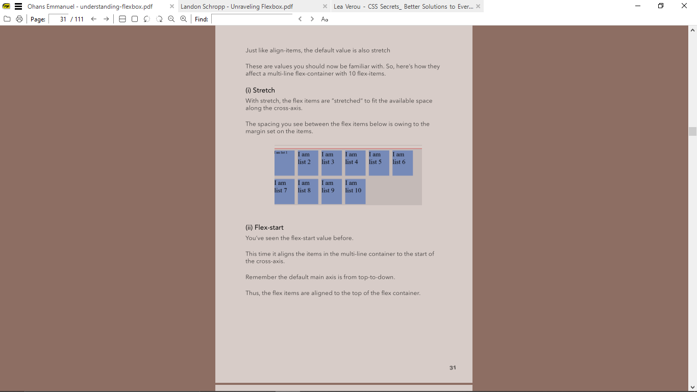

- [References](#references)
- [Introduction](#introduction)
- [Terminology](#terminology)
- [Using the Flexbox model](#using-the-flexbox-model)
- [Flex Container Properties](#flex-container-properties)
- [Flex Items Properties](#flex-items-properties)

# References
> **Unraveling Flexbox** by *Landon Schropp*
>
> **Understanding Flexbox** By *Ohans Emmanuel*

# Introduction
Flexbox provides an efficient way to layout, align, and distribute space among elements within your document - even when the viewport and size of elements is unknown and/or dynamic.

# Terminology
1. Flex container  
   The parent element set to `display:flex`

2. Flex items  
   The children elements within a flex container

3. Main axis
The default axis for aligning flex-items. Default is *row*.

4. Cross axis
  The secondary axis for aligning flex-items.

# Using the Flexbox model
To set a flex container, set the `display` property to `flex` or `inline-flex` for the inline variation.
```css
display: flex;
display: inline-flex;
```

The container now has a main axis and cross axis. Either could be horizontal or vertical.

# Flex Container Properties

1. The `flex-direction` property  
**Possible values: row(default) | column | row-reverse | column-reverse**

Decides if the flex-items are aligned in the horizontal(row) or vertical(column) direction. 

When flex-direction is set to column, the main axis becomes the vertical axis, and the cross axis becomes the horizontal. 

1. The `flex-wrap` property  
**Possible values: wrap | nowrap(default) | wrap-reverse**

Decides if items go to the next line if they are too much for one line.


3. The `flex-flow` property
Shorthand property for `flex-direction` and `flex-wrap` values.

```css
flex-flow: flex-direction flex-wrap;

flex-flow: row wrap;
```

4. The `justify-content` property
**Possible values: flex-start(default) | flex-end | center | space-between | space-around**

Defines how flex-items are laid out on the main axis.

`space-between` keeps the same space between each flex item.


`space-around` keeps the same space around flex items.



5. The `align-items` property
**Possible values: flex-start | flex-end | center | stretch(default) | baseline**

Defines how flex-items are laid out on the cross axis.

`stretch` lets the flex-items fill the entire height of the flex container.


`baseline` align items along their baselines - 


6. The `align-content` property
**Possible values: flex-start | flex-end | center | stretch(default) | baseline**

Controls how flex-items are aligned in a multi-line flex container (when `flex-wrap: wrap`)

`stretch` causes items to fit available space along cross-axis. Any available space is created by setting margins.



# Flex Items Properties
1. The `order` property
Allows for reordering flex items within a container.

Takes number values, negative and positive.

The item with the greater number appears later. Items with the same order value appear the way they are arranged in the source document.

2. The `flex-grow` and `flex-shrink` properties  
Let you control how much an item should *grow* or *shrink* if there are no extra spaces.

3. The `flex-basis` property
Specifies the initial size of a flex-item before the `flex-grow` and `flex-shrink` properties adjust it's size.

Default value is `auto`. If setting to zero, use `0px` instead of `0`.

4. The `flex` shorthand  
Allows you set `flex-basis`, `flex-grow` and `flex-shrink` properties at once.
```css
flex: flex-grow flex-shrink flex-basis;

flex: 1 1 auto;
```

5. The `align-self` property
**Possible values: auto | flex-start | flex-end | center | stretch | baseline**

Allows the positioning of a single flex-item along the cross-axis.

the `auto` value sets the value of the flex-item to the parent's align-items value or stretch if it has no parent.

# Absolute and Relative Flex Items
The difference has to do with the spacing and how they are computed.

IN a relative flex item, spacing is computed based on content size.
`flex: 1 1 auto;`

In an absolute flex item, spacing is calculated based on flex not content.
`flex: 1 1 0;`

No flex-basis.
