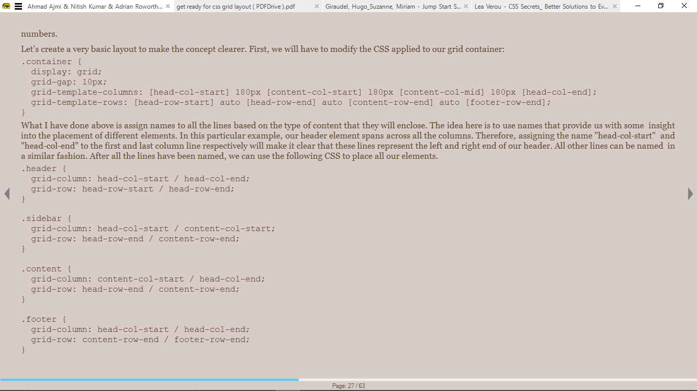
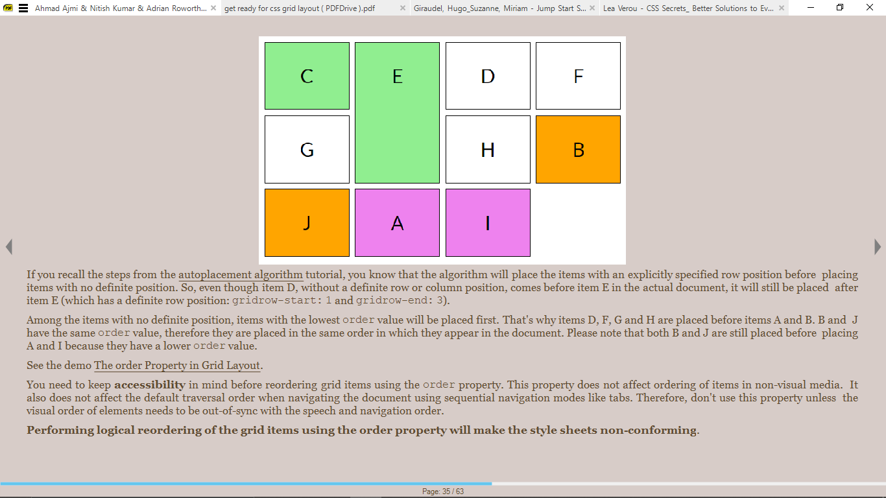

- [References](#references)
- [Introduction](#introduction)
- [Terminology](#terminology)
- [Creating a Grid](#creating-a-grid)
  - [Nested grids and sub-grids](#nested-grids-and-sub-grids)
  - [The `repeat` keyword](#the-repeat-keyword)
- [Positioning Grid Items](#positioning-grid-items)
  - [Using a Line Number](#using-a-line-number)
  - [Using Named Areas](#using-named-areas)
  - [Using the `span` keyword](#using-the-span-keyword)
  - [Using Named Lines](#using-named-lines)
- [Ordering and Aligning Items](#ordering-and-aligning-items)
  - [The `order` property](#the-order-property)
  - [Aligning Content Along the Row](#aligning-content-along-the-row)
  - [Aligning content along the Column](#aligning-content-along-the-column)
  - [Aligning the Whole Grid](#aligning-the-whole-grid)
  - [Shorthand Properties](#shorthand-properties)
- [The Autoplacement Algorithm](#the-autoplacement-algorithm)
  - [Fundamental Concepts](#fundamental-concepts)
  - [Steps in the Algorithm](#steps-in-the-algorithm)

# References
> **Designing with CSS Grid Layout** by *Ahmad Ajmi, Nitish Kumar and Adrian Roworth*
> 
> **Get Ready for CSS Grid Layout** by *Rachel Andrew*


# Introduction
A layout system that allows us to design pages using a 2-d grid.

# Terminology
1. Grid Lines  
    Make up the grid and can be horizontal or vertical.

2. Grid track  
    Space between two grid lines. Can be horizontal or vertical.
    Can represent cells or gutters.

3. Grid cell  
    Space between four grid lines. It is the smallest possible unit on a grid.
    Similar to a table cell.

4. Grid area  
    Any area of the grid bound by four grid lines. Can include any number of grid cells.

5. Grid gutter  
    Space between cells

6. **Grid Item**: Children elements of the grid container. E.g `.tweets` and `.replies`

7. **Grid Lines**: Line that exists on either side of a column or row.


# Creating a Grid


```html
<div class="app-layout">
  <div class="tweets">Tweets</div>
  <div class="replies">Replies</div>
  <div class="search">Search</div>
  <div class="messages">Messages</div>
</div>
```

```css
.app-layout {
  display: grid;
  grid-template-columns: 1fr 1fr 1fr 1fr; /*The container is divided into four equal columns*/
  grid-template-rows: 100vh;
}
```

Applying `display:grid;` to the element makes it a grid container.

The `grid-template-columns` property specifies the width of each grid column in the grid.

The `grid-template-rows` specifies the height of each grid row.

## Nested grids and sub-grids
```css
.content {
  grid: subgrid;
}
```
## The `repeat` keyword
Used to let a pattern repeat as often as it needs to.
```css
.container {
  display: grid;
  grid-gap: 10px;
  grid-template-columns: repeat (5, [one-eighty] 180px [one-eighty] 180px;)
}
```

This means that this pattern repeats 5 times or for 5 columns.

# Positioning Grid Items


## Using a Line Number
Can refer to an exact line number in a  grid.

Use the `grid-column-start` and `grid-column-end` properties.

The `grid-row` property which row the targeted element is in. It is shorthand for the `grid-row-start` and `grid-row-end` properties.

The `grid-column` lets you specify both the start and end line in one property.

```css
.tweets {
grid-column-start: 1;
grid-column-end: 2;
grid-row: 1;
}

.tweets {
grid-column: 1 / 2;
grid-row: 1;
}
```

## Using Named Areas
Specified using the  `grid-template-areas` and the `grid-area` properties.

```css
.app-layout {
  display: grid;
  grid-template-columns: 1fr 1fr 1fr 1fr;
  grid-template-rows: 100vh;
  grid-template-areas: "tweets replies search messages";
}

.tweets {
grid-area: tweets;
}

/*Shorthand for grid-area*/
.selector {
  grid-area: row-start / col-start / row-end / col-end;
}
```

```css
.wrapper {
  display: grid;
  grid-gap: 10px;
  grid-template-columns: 180px 180px 180px;
  grid-template-areas: "header header header"
"content content advert"
"content content ..."
"footer footer footer";
}
```

The `grid-gap` property is used to create grid gutter. It is shorthand for the `grid-column-gap` and `grid-row-gap`.


## Using the `span` keyword


Specifies the number of columns or rows a particular element will span.

```css
.selector {
  grid-row: row-start / span row-span-value;
  grid-column: col-start / span col-span-value;
}

.selector {
  grid-row: 1 / span 2;
  grid-column: 1 / span 2;
}
```

## Using Named Lines



# Ordering and Aligning Items

## The `order` property
Used to specify the order in which different should be placed inside a grid.

Very useful when items are added dynamically.

Items with the lowest order value are placed first in the grid. Items with higher values are placed later.

Items with the same order value will appear as they do in the source document.


```html
<div class="item a"></div>
<div class="item b"></div>
<div class="item c"></div>
<div class="item d"></div>
<div class="item e"></div>
<div class="item f"></div>
<div class="item g"></div>
<div class="item h"></div>
<div class="item i"></div>
<div class="item j"></div>
```

```css
.c {
  grid-row-start: 1;
  grid-row-end: 2;
}

.e {
  grid-row-start: 1;
  grid-row-end: 3;
}

.b, .j {
  order: 2;
}

.a, .i {
  order: 3;
}
```

## Aligning Content Along the Row
Use the `justify-self` and `justify-items`.

`justify-self` aligns the content of a single grid item, while `justify-items` aligns all the items in the grid.

Possible values:
1. `end` - aligns to right
2. `start` - aligns to left
3. `center` - aligns to center
4. `stretch`(default) - fills whole width of grid area

## Aligning content along the Column
Use the `align-self` and `align-items`.

Possible values:
1. `end` - aligns to top
2. `start` - aligns to bottom
3. `center` - aligns to center
4. `justify` - fills whole width of grid area

## Aligning the Whole Grid

`justify-content` - row
`align-content` - column

Possible values:
1. `end`
2. `start`
3. `center`
4. `justify`
5. `space-around`
6. `space-between`
7. `space-evenly`

## Shorthand Properties
The `place-self` property is a shorthand for the `justify-self` and `align-self` properties
```css
place-self: justify-self align-self;
place-self: horizontal vertical;
```

The `place-items` property is a shorthand for the `justify-items` and `align-items` property.
```css
place-items: justify-items align-items;
place-items: horizontal vertical;
```

The `place-content` property is a shorthand for the `justify-content` and `align-content` property.
```css
place-content: justify-content align-content;
place-content: horizontal vertical;
```
# The Autoplacement Algorithm
Steps autoplacement algorithm follows when positioning elements. Controlled by `grid-auto-flow` property.

## Fundamental Concepts
1. **Anonymous grid items**  
Content, like text, placed inside a grid container without being wrapped in a tag.  
They can't be styled, but inherit style rules from parent.

2. **Value of grid spans**  
If not set, the value is 1.

3. **Explicit grid**  
Grid built on the basis of properties like `grid-template-rows`, `grid-template-columns`, and `grid-template-areas`.

4. **Implicit grid**  
If the position of a grid item is specified outside the explicit grid, the browser generates additional grid lines.  
This plus the explicit grid make the *implicit grid*. 

5. **Autoplacement Cursor**
Defines the current insertion point in the grid, specified as a pair of row and column grid lines. At start, it is placed at the start-most row and column in the implicit grid.

## Steps in the Algorithm
The default value of the grid-auto-flow property is `row`. It is assumed to be the value used here.

1. Generation of Anonymous Grid Items  


2. Placement of Elements with an Explicitly Specified Position


3. Placement of elements with a set row but no column position  
To determine the column position, the algorithm behaves in one of two ways, according to the packing mode.

* Sparse packing (default)  
  The column-start line of our item will be set to the smallest possible line index which ensures that there won't be any overlap between the item's own grid area and the cells already occupied by other items.  
  The column-start line also need to be placed past any other item already placed in this row *by* this step.

* Dense packing  
`grid-auto-flow: row dense;`  
To initiate dense packing, the `grid-auto-flow` is set to `row dense`.  
IN this case. the column-start line is also placed at the smallest index.  
Te difference is that if there is an empty space in a row where the element can fit without any overlap, it will be placed in that position without consideration for the previous item in the sam row with the same position rules.

1. Determining the number of columns in the implicit grid

2. Placement of remaining items
* Sparse packing (default)
* Dense packing
