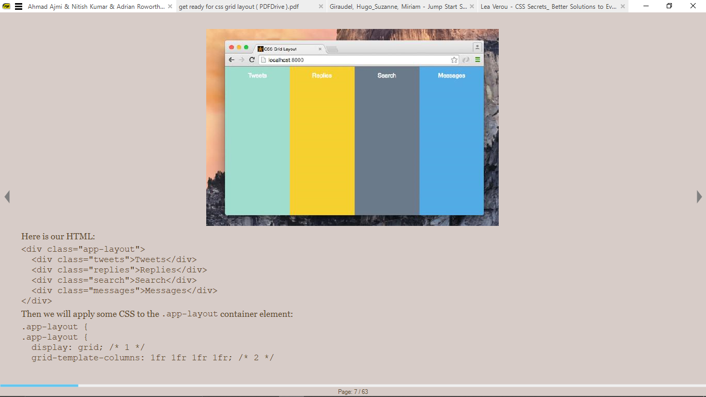
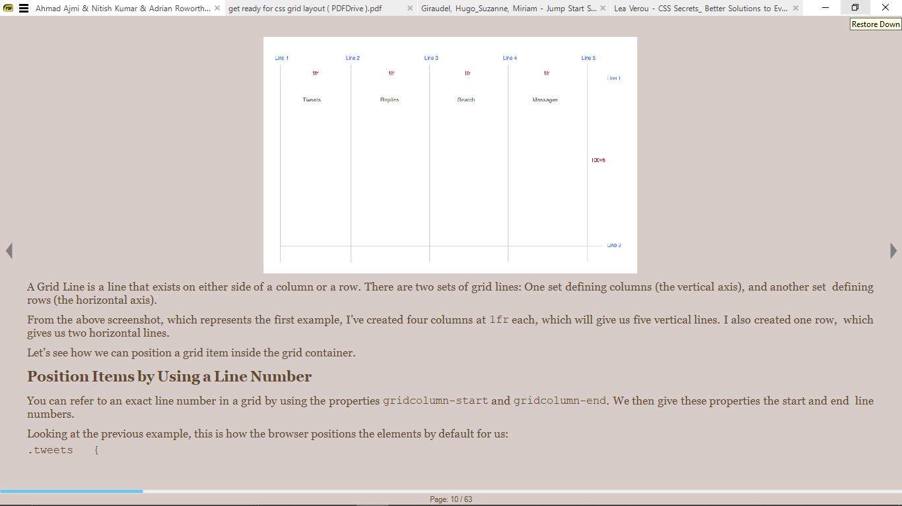
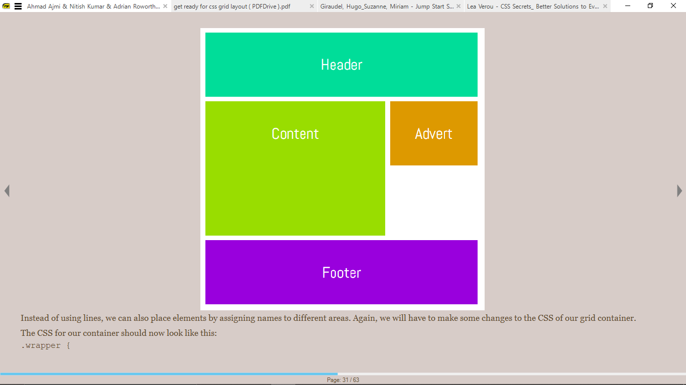
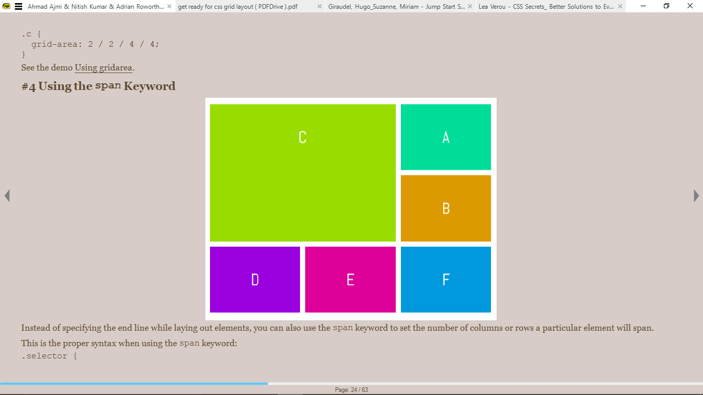

# References
> **Designing with CSS Grid Layout** by *Ahmad Ajmi, Nitish Kumar and Adrian Roworth*
> 
> **Get Ready for CSS Grid Layout** by *Rachel Andrew*


# Introduction
A layout system that allows us to design pages using a 2-d grid.

# Creating a Grid


```html
<div class="app-layout">
  <div class="tweets">Tweets</div>
  <div class="replies">Replies</div>
  <div class="search">Search</div>
  <div class="messages">Messages</div>
</div>
```

```css
.app-layout {
  display: grid;
  grid-template-columns: 1fr 1fr 1fr 1fr; /*The container is divided into four equal columns*/
  grid-template-rows: 100vh;
}
```

Applying `display:grid;` to the element makes it a grid container.

The `grid-template-columns` property specifies the width of each grid column in the grid.

The `grid-template-rows` specifies the height of each grid row.

# Grid Layout Module Concepts

1. **Grid Item**: Children elements of the grid container. E.g `.tweets` and `.replies`

2. **Grid Lines**: Line that exists on either side of a column or row.


# Positioning Grid Items


## Using a Line Number
Can refer to an exact line number in a  grid.

Use the `grid-column-start` and `grid-column-end` properties.

The `grid-row` property which row the targeted element is in. It is shorthand for the `grid-row-start` and `grid-row-end` properties.

The `grid-column` lets you specify both the start and end line in one property.

```css
.tweets {
grid-column-start: 1;
grid-column-end: 2;
grid-row: 1;
}

.tweets {
grid-column: 1 / 2;
grid-row: 1;
}
```

## Using Named Areas
Specified using the  `grid-template-areas` and the `grid-area` properties.

```css
.app-layout {
  display: grid;
  grid-template-columns: 1fr 1fr 1fr 1fr;
  grid-template-rows: 100vh;
  grid-template-areas: "tweets replies search messages";
}

.tweets {
grid-area: tweets;
}

/*Shorthand for grid-area*/
.selector {
  grid-area: row-start / col-start / row-end / col-end;
}
```

```css
.wrapper {
  display: grid;
  grid-gap: 10px;
  grid-template-columns: 180px 180px 180px;
  grid-template-areas: "header header header"
"content content advert"
"content content ..."
"footer footer footer";
}
```

## Using the `span` keyword


Specifies the number of columns or rows a particular element will span.

```css
.selector {
  grid-row: row-start / span row-span-value;
  grid-column: col-start / span col-span-value;
}

.selector {
  grid-row: 1 / span 2;
  grid-column: 1 / span 2;
}
```

## Using Named Lines


## 
