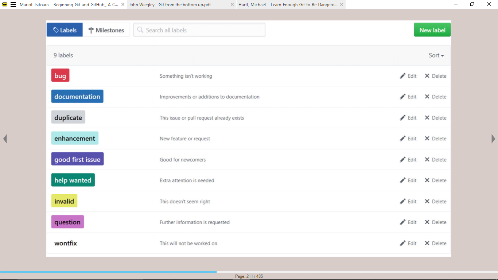

- [References](#references)
- [Introduction](#introduction)
- [Command Line Commands](#command-line-commands)
- [Git Concepts](#git-concepts)
- [Git Configuration](#git-configuration)
- [Git Commands](#git-commands)
- [Ignoring Files in Git](#ignoring-files-in-git)
- [Branching](#branching)
  - [Merging Branches](#merging-branches)
    - [Pull Requests](#pull-requests)
    - [Merge Conflicts](#merge-conflicts)
- [Tagging](#tagging)
- [Git Add](#git-add)
  - [Interactive Add](#interactive-add)
- [Git Commit](#git-commit)
  - [Amending Commits](#amending-commits)
  - [Navigating between versions](#navigating-between-versions)
  - [Making Good Commits](#making-good-commits)
- [Working with Remote Repositories (on Github)](#working-with-remote-repositories-on-github)
  - [Issues](#issues)
    - [Labels](#labels)

# References
> **Beginning Git and Github** by *Mariot Tsitoara*  
> 
> **Getting Good with Git** by *Andrew Burgess*    

# Introduction
Git is a source code manager OR a distributed version control system.

Git is a piece of software used for development.  It is used to keep snapshots of your coding projects.

Version control is about the management of multiple versions of a project. Each change is tracked and VC offers a way to roll back changes.

Local VCSs track changes to files in a single database stored locally.

A central VCS works by storing the change history on a single server that authors can connect to.

With a distributed VCS, each client has a copy of the repo and no main server.

# Command Line Commands
`whoami` prints out your computer name.

`pwd` prints the file path of the working (current) directory.

`ls` and `dir` lists the files in the current directory.

`cd` is used to change directories.
```
// Move to folder within directory
cd images

// Move several folder
cd path/to/deeper/folder

// Go up a folder
cd ..
```

`mkdir` creates new folders.  
`mkdir <new-folder-name>`

`rm` and `del` are used to delete (empty) files or folders  
```
rm <file-name.ext>
rm <folder-name>

del <file-name.ext>
del <folder-name>
```

`cp` or `copy` is used to copy files and `mv` or `move` is used to move files.
```
cp file.ext /path/to/move/to

mv file.ext /path/to/move/to

// Alternative way to rename files
mv name-1.ext name-2.ext
cp name-1.ext name-2.ext
```

`exit` is used to close the command line.

# Git Concepts
1. Repositories
    Folder with the project and where all the changes made are kept.

2. Working Directory
    Files currently being worked on are kept here.

3. Staging Area
    Where files go before the snapshots are taken.

4. `head`
    Reference to a commit. Instead of saying name.

5. `HEAD`
    Current `head`. Commit being checked out.

# Git Configuration
```
// Set name and email address
git.config --global user.name "Mmedara Umana"
git.config --global user.email "mmedara012@gmail.com"
```

# Git Commands
`git init` is the first command initiated in a git directory. It initiated the repository.

`git status` shows the status of the files in the directory.

`git add` tells Git which files to track. This command moves the files into the staging area - the preparation area.
```
// Track all files
git add

// Track specific files
git add file-1.ext file-2.ext
```

`git commit` does... A message is provided with every commit

`git log` shows the commit log of the project from the most recent to the oldest
```
// Move forward one line
Up arrow key or `j`

// Move backward one line
Down arrow key or `k`

// Move forward or backward one window
f and b

// Go to end of log
G

// Go to beginning of log
g

// Get help
h

// Quit log
q

// Reverse order of commits
git log --reverse

// Limit number of commits shown
git log -n <number>
git log --since=<date>
git log --after=<date>
git log --until=<date>

// Show all commits from a specific author
git log --author=<name>

// Show change statistics
git log --stat

// Show commits in a simple graph
git log --graph

// Show commits in a single line
git log --oneline
```

`git update`

`git revert` removes files from the staging area and returns them to the working directory.  
`git revert <commit-name>`
Make sure the working directory is clean before reverting a commit -- check using `git status`.  
`git revert` creates a ew commit undoing the one indicated. 

`git diff` shows what has changed between two files, commits or branches. Checked changes to files in the working directory.  
Compared current modified files to files in the last commit.
```
// Show difference to working directory from last commit
git diff

// Show difference in one file
git diff file.ext

// Compare what's in staging area with latest commit
git diff --cached
git diff --cached file.ext

git diff hash
git diff HEAD file.ext

// Compare difference between branches
git diff branch-1..branch-2

// Check changes to staged files
git diff --staged (..)
```

`git stash` acts like a temporary commit. You can create more than one stash.
```
// Create stash
git stash

// Recover stash
git stash apply

// List stashes
git stash list

// Add stash message
git stash save "message"

// To recover particular stash, use stash ordinal spec
git stash apply stash@{1}

```

`git rm --cached file.ext` is used to unstage a file.

`git show <commit-name>` shows what changes have been made to a project.

# Ignoring Files in Git
Files to be ignored in git are added to the `.gitignore` file.

The `.gitignore` file should be placed in the root repository.

```
// Ignore file in any directory
file.ext
dir/file.ext

// Ignore a directory and all its files
dir/
dir

// Ignore all files with a particular extension
*.ext
dir/*.ext

// Ignore all files that start with temp
temp*

// Ignore any directory named dir
**/dir

// Ignore any file named file in any directory named dir
**/dir/file.ext

// Ignore any file named result.exe in any directory inside output
output/**/result.exe

// Ignore all files except (doesn't work with directories)
*.ext --> Ignore all .ext files
!file.ext --> except
```

# Branching
Creates a safe sandbox to test features that is a complete replica of the repo it is branched from up to the point it is branched.

The default branch is the `main` branch. All changes made in a branch are not available in the others.

You should not switch branches if you have uncommitted changed files.

You should not delete a branch you are currently working on
```
// List all branches
git branch

// Create new branch
git branch new-branch

// Move to another branch
git checkout new-branch

// Delete a branch
git branch -d <name>

// Create and move to a new branch at the same time
git checkout -b new-branch

// Roll back files to version in the staging area
git checkout -- file.ext

// Roll back to version of file in a commit
git checkout HEAD file.ext
git checkout HEAD file.ext

// Show all remote and local branches
git branch -a
```

## Merging Branches
Merging reproduces the commits on one branch on the other.
1. After committing second branch, checkout the branch it will be merged into
    `git checkout <branch-1>`

2. Merge branch 2 while on branch 1
    `git merge <branch-2>`

```
// Push a branch to remote
git push <remote-name> <branch-name>
```

### Pull Requests
When pulling a branch, make sure to be on the branch that is being pulled.

A pull request is asking for permission to execute a pull action on a remote repo.

### Merge Conflicts

# Tagging
Used to create versions.

There are two types of tags -
1. **Lightweight tags** are branches that can't be updated.

2. **Annotated tags** contain a lot of the info a regular commit has.

```
// Lightweight tags
git tag v0.5.6

// Annotated tags
git tag -a stable-1

// Add a message to annotated tags
git tag -a RC1 -m "the message"

// List all tags
git tag

// See info about a tag
git show <tag-name>
git show v0.5.6

// Show commits made after tag
git describe
```

# Git Add

## Interactive Add


# Git Commit
A commit is a snapshot from the state of the project. The previous state of the project is known as the `parent`.  
A commit with two parents is created by merging two branches.

A commit is identified by it's name, a 40-character SHA1 hash. Multiple commits with the same info will have the same name.

A reference to a specific commit is called `head`, and the head currently being worked on is `HEAD`


## Amending Commits
`git commit --amend` add whatever files you forgot to last commit. The files have to be placed in the staging area.

The new commit and its message will override the old one. The hash will be different 'cause its basically removing the old commit and making a new one.

## Navigating between versions
`git checkout <commit-name>` is used to bring back the previous state of the project to the working directory.

Can't do this if the working directory isn't clean. Make sure to commit changes before switching snapshots.

Do not change anything in previous snapshots,

## Making Good Commits
A commit must stand by itself. If a commit needs other commits to make sense, it shouldn't exist.

A commit must be concise and straight to the point. You just need to explain why things changed, not what was changed.

Since you're not the only one reading the code, invest time to explain the context of the changes and why they were done.

Commit messages should not be longer than 50 characters, and should begin with a capital letter.

Don't end commit messages with a period.

Write messages in present tense and ditch unnecessary articles

Commit messages should be clear, not vague.

# Working with Remote Repositories (on Github)
`git clone` clones remote repo to computer.
```
git clone remote-repo-url repo-name-on-computer
```

`git remote` lists the remote repositories linked to a project.  
Yiu need to create the name for the remote repo 'cause you can have multiple remotes in a single project. The default name is `origin` - recommended for the remote where teammates share their work.
```
// Link a remote repo to a local repo
git remote add <remote-name> <remote-link>
git remote add origin http/name.git

// Remove remotes linked to a project
git remote rm <remote-name>

// Check if remote has been added
git remote -v
```

`git fetch` fetches changes from remote repo.
```
git fetch remote-repo remote-branch
git fetch origin master
```

`git pull` gets the latest commits from a remote repo.

`git push` pushes the local repo to a remote one
```
git push <remote-name> <branch-name>
git push origin main
```

`git rebase`

## Issues
Used to indicate tasks that need to be done, and are closed when they have been accomplished.

Each issue has a unique number that cannot be recycled, even if the issue is deleted.

The team can discuss the idea in the comments section. 

Issues can be referenced in commits, most likely the commits that attempt to solve them. The easiest way to do that is to mention the issue number in the commit message. It will appear in the details section of the issue.

### Labels
Texts to help you quickly filter through issues.


You can assign issues to a developer or developers.

