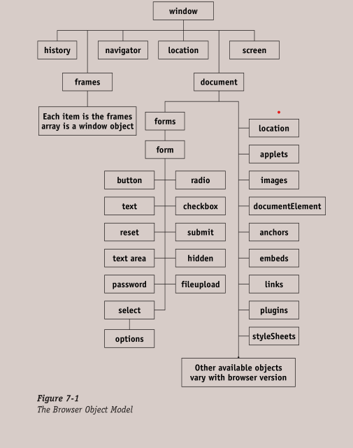

# Table of Contents
- [Table of Contents](#table-of-contents)
- [References](#references)
- [Introduction](#introduction)
  - [Syntax](#syntax)
    - [Comments](#comments)
    - [Escaping Characters](#escaping-characters)
  - [Memory Leaks](#memory-leaks)
- [Variables](#variables)
  - [Rules for naming a variable](#rules-for-naming-a-variable)
  - [Scope of a Variable](#scope-of-a-variable)
  - [Global scope](#global-scope)
  - [Local Scope](#local-scope)
- [Data Types](#data-types)
  - [String](#string)
    - [Template Literals](#template-literals)
    - [String Operations](#string-operations)
      - [Concatenation](#concatenation)
    - [String Property](#string-property)
    - [String Methods](#string-methods)
      - [The `charAt()` method](#the-charat-method)
      - [The `concat()` method](#the-concat-method)
      - [The `indexOf()` method](#the-indexof-method)
      - [The `lastIndexOf()` method](#the-lastindexof-method)
      - [The `repeat()` method](#the-repeat-method)
      - [The `split()` method](#the-split-method)
      - [The `substring()` method](#the-substring-method)
      - [The `startsWith()` method](#the-startswith-method)
      - [The `endsWith()` method](#the-endswith-method)
      - [The `trim()` method](#the-trim-method)
      - [The `toLowerCase()` and `toUpperCase` methods](#the-tolowercase-and-touppercase-methods)
  - [Symbols](#symbols)
  - [Numbers](#numbers)
    - [Arithmetic Operations](#arithmetic-operations)
  - [Undefined](#undefined)
  - [Null](#null)
  - [Booleans](#booleans)
- [Operators](#operators)
  - [Logical Operators](#logical-operators)
    - [Logical NOT (!)](#logical-not-)
    - [Logical AND (\&\&)](#logical-and-)
    - [Logical OR (||)](#logical-or-)
  - [Bitwise Operators](#bitwise-operators)
    - [Bitwise NOT (~)](#bitwise-not-)
    - [Bitwise AND](#bitwise-and)
    - [Bitwise OR](#bitwise-or)
    - [Bitwise XOR](#bitwise-xor)
  - [Assignment Operators](#assignment-operators)
  - [Comparison Operators](#comparison-operators)
    - [(Soft) Equal `==`](#soft-equal-)
    - [Strict equal `===`](#strict-equal-)
  - [Mathematical Operators](#mathematical-operators)
- [Type Coercion](#type-coercion)
  - [Converting Between Strings and Numbers](#converting-between-strings-and-numbers)
    - [Strings to Numbers](#strings-to-numbers)
- [Arrays](#arrays)
  - [Working with Arrays](#working-with-arrays)
    - [Adding to an array](#adding-to-an-array)
    - [Removing values from arrays](#removing-values-from-arrays)
    - [Merging Arrays](#merging-arrays)
    - [Destructuring Arrays](#destructuring-arrays)
  - [Array Properties](#array-properties)
  - [Array methods](#array-methods)
- [Sets](#sets)
  - [Methods of Sets](#methods-of-sets)
  - [Converting Sets to Arrays](#converting-sets-to-arrays)
  - [Weak Sets](#weak-sets)
- [Maps](#maps)
  - [Map Methods and Properties](#map-methods-and-properties)
  - [Converting Maps to Arrays](#converting-maps-to-arrays)
  - [Weak Maps](#weak-maps)
- [Objects](#objects)
  - [Adding to an Object](#adding-to-an-object)
  - [Reading from an object](#reading-from-an-object)
  - [Nested Objects](#nested-objects)
    - [Reading from a nested object](#reading-from-a-nested-object)
    - [Assigning object items](#assigning-object-items)
- [Flow of Control Statements](#flow-of-control-statements)
  - [The `if` and `if...else` statements](#the-if-and-ifelse-statements)
    - [Ternary Operator](#ternary-operator)
  - [The `switch` statement](#the-switch-statement)
- [Loops](#loops)
  - [The `while` loop](#the-while-loop)
  - [The `do...while` loop](#the-dowhile-loop)
  - [The `for` loop](#the-for-loop)
  - [The `for...in` loop](#the-forin-loop)
- [Jumps](#jumps)
  - [The `break` statement](#the-break-statement)
  - [The `continue` statement](#the-continue-statement)
  - [The `return` statement](#the-return-statement)
- [Functions](#functions)
- [The Browser Object Model](#the-browser-object-model)
  - [Objects and Properties of the BOM](#objects-and-properties-of-the-bom)
- [The Window Object](#the-window-object)
  - [Properties of the Window Object](#properties-of-the-window-object)
  - [Methods of the Window Object](#methods-of-the-window-object)
- [The Document Object Model](#the-document-object-model)
- [The Document Object](#the-document-object)
  - [Properties of the `document` Object](#properties-of-the-document-object)
  - [Methods of the  `document` Object](#methods-of-the--document-object)
- [Events](#events)
- [Working with Forms](#working-with-forms)
  - [Properties of the `form` object](#properties-of-the-form-object)
  - [Methods of the `form` object](#methods-of-the-form-object)
  - [Working with Form Controls](#working-with-form-controls)
    - [Select Lists](#select-lists)
- [Working with Images](#working-with-images)
  - [Properties of the `Image` object](#properties-of-the-image-object)
  - [Events of the `Image` object](#events-of-the-image-object)
- [Validating Form Data](#validating-form-data)
- [Cookies](#cookies)
  - [Attributes of a Cookie](#attributes-of-a-cookie)
- [Objects in JavaScript](#objects-in-javascript)
  - [The `Date` object](#the-date-object)
    - [The Date object methods](#the-date-object-methods)
      - [The UTC Date methods](#the-utc-date-methods)
  - [The Math Object](#the-math-object)
    - [Properties of the Math object](#properties-of-the-math-object)
    - [Methods of the Math object](#methods-of-the-math-object)
  - [The location Object](#the-location-object)
    - [Properties of the location Object](#properties-of-the-location-object)
    - [Methods of the location object](#methods-of-the-location-object)
  - [The `history` Object](#the-history-object)
    - [Methods of the history object](#methods-of-the-history-object)

# References
> **JavaScript Weekend Crash Course** by *Steven Disbrow*
> 
> **JavaScript: Novice to Ninja** by Darren Jones  


# Introduction
JS is an object-oriented scripting language. An object-oriented language...

*Server-side* JS is JS that runs on a web server. HEre, server-side extensions help apps interact with databases, conduct file changes and provide a continuous flow of information.  
*Client-side* JS runs in the browser and its DOM. Helps apps save elements into HTML and react to user actions.

## Syntax
JS is case-sensitive and utilizes unicode characters. It supports whitespace characters.

The JS compiler scans source code from left to right
### Comments
```js
// This is a single-line comment
/* This is a multi-line comment */
```
JS doesn't support nested comments

### Escaping Characters
The **backslash(/)** is used to escape special characters in strings such as quote marks(\', \"), end of line (\n), carriage return(\r), tab(\t) and also a backslash(`\\`).

*Properties* are information about the object or value. Example
```js
string.length //length is the property`
```
*Methods* perform an action on the object or value.

## Memory Leaks
A memory leak occurs when a program retains references to values that can no longer be accessed in its memory. Memory is used to store values that are no longer required by the program.

Memory leaks case problems by gradually reducing the overall memory available, causing the program to lag.


# Variables
Variables are the most basic form of data storage in JavaScript. They are symbolic identifiers for values needed by your programs.  
```js
//Single declaration
var task = "Write the first chapter.";

// Multiple declarations
var task = "Write the first chapter.",
    complete = true;

```
JavaScript is case-sensitive so `task` and `Task` will be treated as different variables.  
The semi-colon `;` indicates the end of a line of code.  
It is best to keep variable declarations and initializations separate so errors encountered when debugging can be easily sorted out.
```js
var task, complete;
task = "Write the first chapter.";
complete = true;
```

`var` is not really used anymore in ES6.
`let` is used to create a local variable that may be be reassigned. During the declaration, you may assign a value to the variable.  
`const` is used to create a constant. Their values can't be changed after declaration.

`let` and `const` are block-scoped; their value only exists in the block they are declared in.

If you assign a value to a variable that hasn't been declared yet, you get a global variable.


## Rules for naming a variable
1. Variable names are case sensitive.
2. Variable names must start with an alphabet *(A-Z)*, a dollar sign *($)* or an underscore *(_)* and can contain numbers, letters, a dollar sign or an underscore.
3. Spaces and other special characters are not allowed.
4. Variable names can be as long you want, but it is advisable to keep them under 50 characters long.

## Scope of a Variable
A concept that determines if a variable or function defined in one part of the program is accessible in another part.

## Global scope
Functions or variables with a global scope are accessible form anywhere in the file. They are declared outside functions.

## Local Scope
Local variables are defined in a function and can only be accessed from the function in which they are defined.

# Data Types
* *null* is used when you want to declare a variable and intentionally express the absence of a value. It is case-sensitive.
* *number* Involves numbers
* *string* involves letters
* *Boolean*
* *undefined* represents the state of a variable that has been declared without a value assigned to it.
* *object*
* *symbol*

## String
### Template Literals
Special types of string that use the backtick character(`) to delimit the string.
```js
`String!`;

// Able to use both types of quotation marks within the string
`She said, "It's Me!"`

// Allows interpolation
const name = 'One';
`string ${ name }!`; //'string One'
```
### String Operations
#### Concatenation
Joining two or more strings together. Uses the plus `+` sign
```js
var stringOne, stringTwo;
var concatString = stringOne + stringTwo;

// Second way
// x += y : x = x + y
stringOne += stringTwo;
```
### String Property
The `length` property returns the length of the string.
### String Methods
Strings are implemented as objects. Methods are functions that belong to an object. They allow you perform tasks using the data in the object.

#### The `charAt()` method
Allows you extract a single character from a specified position in a String object.
`string.charAt([index])`

#### The `concat()` method
Used to concatenate two or more strings.
```js
'string'.concat(' ', 'One'); //string One
'string'.concat('One'); //stringOne

```

#### The `indexOf()` method
Searches a String for the first instance of a substring. Returns `-1` if substring is not found. Spaces are also counted. The `indexOf()` method is case-sensitive.

```js
item = "Stroller and Sunshade";
item.indexOf("Sun"); // Returns 14
```

#### The `lastIndexOf()` method
Searches a String for the last instance of a substring. Searches from the end of the string. You can specify what index the search should start from.

#### The `repeat()` method
Repeats a string the stated number of times
```js
'string'.repeat(2); // 'stringstring'
```

#### The `split()` method
Splits a string into an array

#### The `substring()` method
Extracts a new String from an existing String.
```js
string.substring(indexOne, indexTwo);
```

`indexOne` is the starting position of the string you want to extract.  
`indexTwo` is the position after the last character to be included in the string, else it won't be included. It is optional.

#### The `startsWith()` method
Checks if a string starts with a certain character. It is case-sensitive.

#### The `endsWith()` method
Checks if a string ends with a certain character. It is case-sensitive.

#### The `trim()` method
Removes any whitespace from the beginning and end of a string.
```js
'       String One        '.trim(); //String One
```
#### The `toLowerCase()` and `toUpperCase` methods
Change string to lowercase and uppercase characters respectively.
<!-- ## Type Conversion
JS is dynamically-typed; variables can be declared without specifying the data type. -->


## Symbols
Used to create unique values, which helps to avoid naming collisions.  
Only primitive without a literal form.

```js
const ID = Symbol(description);

const uniqueID = Symbol('this is a unique ID');

// Manually access the description
String(uniqueID) //'String(this is a unique ID)'
```
The description acts as a string representation of the symbol, and is used to log the symbol in the console.
```js
console.log(uniqueID); //Symbol(this is a unique ID)
```

Two variables can point to the same symbol using the `for()` method
```js
const A = Symbol.for('shared symbol');
const B = Symbol.for('shared symbol');

```

## Numbers
Can be integers (whole numbers) or floating point numbers (decimals).

```js
Number.isInteger(number); //CHeck if number is an integer
```

### Arithmetic Operations
Addition  
5 + 4 = 9;

Subtraction  
6 - 5 = 1

Multiplication  
3 * 8 = 24

Division  
2/1 = 2

Exponentiation
2**5 = 32

Modulus  
28%3 =  1; The result always has the same sign as the first number

## Undefined
Value given to variables that have not been assigned a value. It can also occur if an object's property doesn't exist or a function has a missing parameter.  
It is how JS says it can't find a value.

## Null
Means 'no value'. Can be used as a placeholder that JS uses to say "there should be a value here, but isn't here right now."

`null` is coerced to be 0. In general, values tend to be set to `undefined` by JS, whereas are usually set to `null` manually by the programmer.

## Booleans
Only two values - `true` and `false`. 

# Operators

## Logical Operators
Can be used with any primitive value or object. Results are based on whether the values are considered to be *truthy* or *falsy*.

Every value in JS has a Boolean value.
*Falsy values* are always false, and they include `""`, `''`, `0`, \`\`, `0`, `-0`, `NaN`, `false`, `null`, `undefined`.

*Truthy values* are always true. They include most values in JS.

### Logical NOT (!)
Placing it in front of a value will convert it to a Boolean and return the opposite value.

Truthy values return `false`, and falsy values return `true`. This is known as negation.
```js
!true; //false
!0; //true
```

### Logical AND (&&)
Works on two or more values (operands) and only evaluates to `true` if all operands are truthy.

### Logical OR (||)
Works on two or more operands and evaluates to true if any of the operands are true.

## Bitwise Operators
Work with operands that are 32-bit integers. These are numbers written in binary that have 32 digits.

Any values used with bitwise operators are converted into a 32-bit integer before the operation takes place. It is then changed into a base 10 integer to display the result.

Bitwise operators tend to be used for low-level programming tasks or apps that require a number of on-off states.

### Bitwise NOT (~)
Converts a number to a 32-bit integer, then changes all the 1s to 0s. It returns the new value as a negative integer which adds up to the initial operand to make `-1`.

### Bitwise AND

### Bitwise OR
### Bitwise XOR
`XOR` stands for *eXclusive OR*.


## Assignment Operators
```js
var content = "Hi";

// Second Way
// x += y : x = x + y
x = 10; y = 5;
x += y; // x = 15
```

## Comparison Operators
Used to compare values and return `true` or `false` based on how they compare.

### (Soft) Equal `==`
When used, JS doesn't take into account the data type. It will attempt to coerce the two values to the same type when comparing.  
Examples
```js
" " == 0; //true
" " == "0"; //false
```

### Strict equal `===`
Tests for equality, but only returns true if the values are of the same data type.  
Examples:
```js
answer === 5; //true
answer === '5'; //false
NaN === NaN; //false
```

2. Not equal `!=`
4. Strict not equal `!==`
5. Greater than `<`
6. Greater than or equal to `>=`
7. Less than `<`
8. Less than or equal to `<=`

## Mathematical Operators
1. Increment by 1 `++`
2. Decrement by 1 `--`
3. Addition `+`
4. Subtraction `-`
5. Multiplication `*`
6. Division `/`
7. Modulus `%`


# Type Coercion
Happens when the operands of an operator are of different types. In this case, JS will attempt to convert one operand to an equivalent value of the other operand's type.

Example: Multiplying a string and a number together. Js will attempt to coerce the string into a number.  
```js
'2' * 8; //16
'2' + 8; //28
```

## Converting Between Strings and Numbers
### Strings to Numbers
```js
// Using the Number method
Number('23'); //23

Number('hello'); //NaN

// Multiplying string by 1
'5' * 1; //5
```
# Arrays
Arrays are used to store a collection of data. It is an ordered list of values.
```js
// Creating an array
var myArray = new Array(); /*Array constructor function*/
/*OR*/
var myArray = [] /*This is an array literal*/
```
The array literal represents an empty array. It's less verbose and safer to use than the `new Array()` syntax, because the `Array` constructor can be overwritten and replaced with malicious code.

Arrays can contain any data type and they can be mixed
```js
var things = [1, "apple", undefined, 42, "thanks", null, []];
```
## Working with Arrays
### Adding to an array
An empty array can be created and then added to in several ways

```js
// By indices
var myArray = [];
myArray[0] = "Hello";
myArray[1] = "World";
```
Using indices can lead to one-off errors.

```js
// Using named indices
var myArray = [];
myArray["fruit"] = "apple";
myArray["vehicle"] = "tank";
```
This creates an associative array where items are stored by a named index rather than a numbered index. Cannot be retrieved with a numbered index. Uses a special `for` loop
```js
/* Loops through array and presents the value at each index*/
// x = indexName, written as x though
// array[x] = value at indexName
for (x in array) {console.log(array[x])};
```

```js
// Using the push method
var myArray = [];
myArray.push("hello");
```
The `push()` method adds a new item at the end of the existing array.

### Removing values from arrays
```js
const fruits = ['orange', 'apple', 'cherry', 'mango'];
delete fruits[2];
//['orange', 'apple', undefined, 'mango'];
```

The value has been deleted but the space remains and holds the value of `undefined`.  
THe array still has the same number of elements, and the position can still be referenced as an index.

### Merging Arrays
```js
//Using the concat() method
var fruits = ['orange', 'apple', 'cherry', 'mango'];
fruits = fruits.concat('papaya', 'squash', 'banana');
// ['orange', 'apple', 'cherry', 'mango', 'papaya', 'squash', 'banana'];

// Using the spread operator
fruits = [...fruits, ...['papaya', 'squash', 'banana']];
```

### Destructuring Arrays
Taking values out of an array snd presenting them as individual values. It allows us to assign multiple values at the same time, using arrays.

```js
const [x, y] = ['one', 'two'];
console.log (x, y); //one two
```

Destructuring gives a neat way of swapping values of two variables over
```js
var [x, y] = ['one', 'two'];
//Changed from const to var 'cause a constant can't be reassigned
[x, y] = [y, x]; // two one
```

## Array Properties
The `length` property  
Used to find the length of an array.
```js
const fruits = ['orange', 'apple', 'cherry', 'mango'];
fruits.length; //4
```

The length property is mutable, can be changed manually.
```js
const fruits = ['orange', 'apple', 'cherry', 'mango'];
fruits.length = 6;
// ['orange', 'apple', 'cherry', 'mango', undefined, undefined];

const fruits = ['orange', 'apple', 'cherry', 'mango'];
fruits.length = 2;
// ['orange', 'apple'];
```
## Array methods
The `Array()` constructor method  
```js
//With no parameters - creates an empty array
new Array()

// With a length parameter - creates the specified number of empty slots
new Array(length)

// With multiple parameters
// The array slots are filled with the items passed as parameters
new Array(item1, item2, etc.)
```

The `pop()` method  
Removes the last element and returns the rest of the array.

The `push()` method  
Adds an element to the end of the array and returns the new array.

The `reverse()` method  
Reverses the order of items in the array.

The `shift()` method  
Removes the first item and returns the array.

The `sort()` method  
Sorts array items in ascending order or in the order that you specify within a `sort()` function. Every item is converted to strings and arranged.  
The sorting function is called again and again until all elements are sorted.
```js
function simpleSort(item1, item2) {
var result = 0;
if (item1 > item2)
  result = 1;

if (item1 < item2)
  result = -1;

if (item1 == item2) 
  result = 0;

return result;
}
items = new Array("Diapers", "Baby Wipes", "Rattle", "Car Seat", "Stroller");
items.sort(simpleSort);
```

The `splice()` method  
Lets you remove an item or items and/or add a new item or items in its place.  
```js
array.splice(indexToStartFrom, howManyItemsToRemove, [newItem(s)]);
```

The `unshift()` method  
Adds one or more items to the beginning of the array.

The `concat()` method  
Combines multiple arrays into one.  
```js
//arrayN = array1 + array2 + array3
arrayN = array1.concat(array2, array3)
```

The `join()` method  
Takes the values in an array and joins them into a string. You can specify what the separator, but the default is a comma.  
`array.join(",")`

The `slice()` method  
Copies a part of an array and returns it   `arr.slice(startingIndex)`

The `toString()` method  
Returns a string with the items in the array. Exactly the same as using the `join()` method without specifying a delimiter.

The `indexOf()` method
*Check [The `indexOf()` method](#the-indexof-method)* 

The `lastIndexOf()` method
*Check [The `lastIndexOf()` method](#the-lastindexof-method)*


# Sets
A data structure that represents a collection of unique values, so it cannot include any duplicate values. Sets offer a useful way to keep track of data without having to check if a particular value is in a set.  
Sets do not have index notation.

If you try to add a value that already exists, the operation is ignored.
```js
// Creating sets
const list = new Set();

// Adding to sets
list.add("one");
list.add('one').add('two').add('three').add('four');

const list = new Set([1, 2, 3, 4, 4, 4, 4,]);
// Set(1, 2, 3, 4)

const letters = new Set('hello');
// Set('h', 'e', 'l', 'o')
```
All non-primitive values, such as arrays and objects, are considered unique values even if they contain the same values.
```js
const arrays = new Set().add([1]).add([1]);
//Set{ [1], [1]}
```

Type coercion isn't used so string `'2'` can be added if `2` is already an element of the set.

## Methods of Sets
The `size()` method finds the number of values in a set.

The `has()` method checks if a value is in a set. Returns a boolean value of `true` or `false`. Sets do not have index notation.

The `delete()` method can be used to remove a value from a set. Returns `true` if the value was removed and `false` if the value wasn't in the set and couldn't be removed.

The `clear()` method can be used to remove all values from a set.

## Converting Sets to Arrays
```js
//Using the spread operator
const shoppingArray = [...shoppingSet]

//Using the Array.from() method
shoppingArray = Array.from(shoppingSet);
```

## Weak Sets

# Maps
A convenient way of keeping a list of key and value pairs.  
Maps, unlike objects, can use any data type as a key.

```js
//Creating a Map
const newMap = new Map();

// Adding to map
newMap.set('One', 1).set('Two', 2).set('Three', 3);
```

## Map Methods and Properties
The `get()` method is used to retrieve value using a key.

The `has()` method is used to check if a particular key is in a map. Returns `true` or `false`.

The `size` property returns the number of key and value pairs.

The `delete` method can be used to remove a key and value pair. Returns `true` or `false`.

The `clear` method removes all key-value pairs from a map.

## Converting Maps to Arrays
Same as [Converting Sets to Arrays](#converting-sets-to-arrays)
## Weak Maps


# Objects
Like arrays, they are containers for collections of data. Though arrays are actually a type of object.
```js
// Initializing an object
var myObject = new Object();
var myObject = {}; //Safer and preferable
```

Objects use a key/value pair system.
```js
profile = {
    firstName: "Hugo",
    lastName: "Reyes"
};
```

## Adding to an Object
```js
// Bracket Notation
var obj = {};
obj["firstName"] = "Hugo";
obj["lastName"] = "Reyes";

// Dot notation
var obj = {};
obj.firstName = "Hugo";
obj.lastName = "Reyes";
```

## Reading from an object
Arrays cannot be read using a numeric index, just a named one.
```js
// Bracket Notation
alert("Hello, my name is " + obj[firstName] + " " + [obj.lastName] + ".");

// Dot notation
alert("Hello, my name is " + obj.firstName + " " + obj.lastName + ".");
```

## Nested Objects
```js
var person;

person = {
    name: {
        first: "Mmedara",
        last: "Umana"
    }
}
```
### Reading from a nested object
```js
person.name.first; //returns "Mmedara"
person.name.last; //returns "Umana"
```

### Assigning object items
```js
var person;

person = {};
person.name = {};
person.name.first = "Mmedara";
person.name.first = "Umana";
```


# Flow of Control Statements
## The `if` and `if...else` statements
Lets you decide if a block of code will execute.
```js
//if statement
if (condition) {
    do thing;
    do another thing;
    }

//if...else statement
if (conditon) {
    do thing;
} else {
    do other thing;
}

// nested if...else statements
if (condition) {
    if (..){}else{}
} else {
    if (..){}else{}
}
```

### Ternary Operator
Used to shorten the `if..else` statement
```js
// If...else statement
if (hours < 10) {
  hours = "0" + hours;
} else {
  hours = hours.toString();
}

// Ternary Operator
result = (conditon) ? (evaluate if true) : (evaluate if false);
hours = (hours < 10) ? "0" + hours : hours.toString();
```

We could make the example even shorter by placing the ternary operator
inside a template string:
```js
console.log(`n is a ${(n%2 === 0)? 'even' : 'odd'} number`);
```

## The `switch` statement
Allows you choose between the known values of a variable and execute a corresponding cede block.
```js
// General expression
switch(variable) {
    case One: {
        do thing;
        break;
    }
        case Two: {
        do another thing;
        break;
    }
        default: {
        do default thing;
    }
}

// Example
strollerPrice = 199;

switch (strollerPrice) {
  case 49: {
    document.write("Wow! This is cheap!");
    break;
  }
  case 99: {
    document.write("Very affordable");
    break;
  }
  case 149: {
    document.write("A bit pricey, but nice!");
    break;
  }
  default: {
    document.write("This is a high-end model!");
  }
}
```

# Loops
A *loop statement* is used when we want to repeat some programming statements until a specified condition is reached.

When looping over sets, the loop will iterate over each value in the same order in which they were added to the set. Sets are enumerable; they have methods that allow you to loop over each value in the set.
## The `while` loop
```js
while (condition) {
    statement
}

// Example
var tasksToDo = 3;

while (tasksToDo > 0) {
  console.log("There are " + tasksToDo + " tasks to do.")
  tasksToDo--;
}
```

## The `do...while` loop
Used when a statement has to be executed at least once.
```js
do {
    statement
} while (expression);

// Example
var tasksToDo = 3;

do {
  console.log("There are " + tasksToDo + " tasks to do.");
  tasksToDo--;
} while (tasksToDo > 0);
```

The condition can be any expression that evaluates to true or false. The statement is executed if the condition evaluates to true.


## The `for` loop
Used to run a code block a number of times.
```js
for (initialization; condition; end-expression) {
    statement
}

for (var i = 0; i < 3; i++) {
    console.log(i);
}

// Multiple Tests
// Testing that i is less than 10 and divisible by 2
for (var i = 0; i < 10 && i % 2 === 0; i+=4) {
    console.log(i);
}

// Multiple Initializations
for (var i = 0, j = 0; i < 3; i++, j+=2) {
    console.log(i, j);
}

//Other end expressions
// Prints random numbers until it gets a value of o.9 or greater
for (var i = 0; i < 0.9; i = Math.random()) {
    console.log(i);
}

// Nested for loops
```

## The `for...in` loop

# Jumps
A *jump statement* allows code to exit loops. It is used to move to another part of the script.
* `break`
* `continue`
* labeled statements
* `return`
  
`return` is used for exiting functions, while the rest are used with loops.

## The `break` statement
Used to exit from a loop.
```js
var tasks = [
  { name: "Buy milk", complete: false },
  { name: "Trash", complete: false },
  { name: "Pay bills", complete: true },
];
var firstComplete;

for (var i = 0; i < tasks.length; i++) {
  if (tasks[i].complete) {
    firstComplete = tasks[i];
    break;
  }
}
console.log(firstComplete);
```

## The `continue` statement
Skips to the next iteration in the loop. In a `while` loop, the condition is tested again. In a `for` loop, the end expression is run and the loop continues
```js
// Prints tasks that are complete

var tasks = [
  { name: "Buy milk", complete: false },
  { name: "Trash", complete: false },
  { name: "Pay bills", complete: true },
  { name: "Repairs", complete: false },
  { name: "Plumber", complete: true },
];
var firstComplete;

for (var i = 0; i < tasks.length; i++) {
  if (!tasks[i].complete) {
    continue;
  }
    console.log(i, tasks[i].name);
}
```

## The `return` statement
```js
// General expression
return expression;

return;
```
Can only be used within a function and is used to delineate the return value of a function. If omitted, the return value is undefined.


# Functions
Functions are only executed when you call them.
```js
function fnName(parameters) {do something}
```

# The Browser Object Model
A collection of JS objects that act as an intermediary between JS programs and the web browser. It is made up of objects that allow JS programs peek into every corner of the web browser.

The purpose of the BOM is to provide a simple, consistent interface between your JS programs and the web browser.

## Objects and Properties of the BOM


* The `document` object  
  Represents the currently loaded HTML page.

* The `frames` array  
  JS treats each frame that appears in the browser as a window object all to itself. If a website uses frames, the actual window object is known as the *parent window*.

* The `location` property  
  A String object that contains the address of the web page currently loaded into the web browser.

* The `navigator` object  
  Holds details about the brand, version and capabilities of your web browser. Also contains detailed lists of the plug-ins that are installed and the MIME types that the browser knows about.

# The Window Object
A JS object that represents the entire web browser window.  
You don't have to name the `window` object at all. It can also be referred to as `parent`, `self` or `top`.
Example:
```js
document.write();
//IS THE SAME AS
window.document.write();
parent.document.write();
self.document.write();
top.document.write();
```

## Properties of the Window Object
1. The `closed` property   
Tells you if a window object represents an open browser window.

2. The `defaultStatus` property  
Specifies a string that will be displayed in the browser's status bar.

3. The `document` property  

## Methods of the Window Object
The `alert()` method  displays a dialog box with a specified message and an OK button. The JS program halts until the user clicks the OK button.

The `blur()` method removes focus from the associated window object.

The `clearInterval()` and `clearTimeout()` methods:  
For the `clearInterval()` method, go [here](#setinterval)  
For the `clearTimeout()` method, go [here](#settimeout)  


The `close()` method closes the associated browser window.

The `confirm()` method lets you ask the user a dimple OK or Cancel question.

The `focus()` method tells the web browser to direct keystrokes to the specified window object.

The `moveBy()` method moves the specified window by a specified number of pixels.
```js
self.moveBy(horizontal, vertical);
self.moveBy(10, 30)
```

The `moveTo()` method moves the specified window to an absolute position on the screen.

Thw `open()` method opens a new browser window and returns a new `window` object to represent it. You can pass up to four parameters in this order:
1. `url`
2. `name`: a string that will be placed into the `window.name` property of the new window
3. `featuresList`: string specifying the features the new window should have - how big it should be, if it should have toolbars, scroll bars, etc.
4. `replace`: Boolean value that specifies if the url in the `url parameter should replace the current entry in the history list.

The `prompt()` method allows you ask the user a question and get an answer in a text box.

The `resizeTo()` method will resize a browser window to the width and height specified.  
`self.resizeTo(width, height)`

The `scrollBy()` method will scroll a document a specified number of pixels from its current position.  
`scrollBy(horizontal, vertical)`

<span id="setinterval"> The `setInterval()` and `clearInterval()` methods</span> are similar to the `setTimeout()` method except the statement is executed over and over again.

<span id="settimeout">The `setTimeout()` and `clearTimeout()` methods</span>
The `setTimeout()` method takes two parameters:  
1. A string that is a valid JS statement
2. The time in milliseconds it takes for the string to be executed
This method doesn't set up a recursive call - cannot be executed more than once.
# The Document Object Model
Represents the HTML file.  

Allows your JS program do the following:
1. Interact with HTML forms
2. Manipulate cookies
3. Interact with images
4. Interact with Java applets

# The Document Object
A JS object that represents the HTML page that's currently being loaded into the Web browser.

## Properties of the `document` Object
The `alinkColor` property specifies the color used to display a currently active link

The `anchors` array holds one `Anchor` object for each set of the `name` attributes of `<a>` tags that are in the document.

The `applets` array holds all the Java applets that are embedded in the HTML document.

The `bgColor` property

The `cookie` property lets you read and set the client's cookie value for an HTML document.
```js
//Reading a cookie
var theCookie = document.cookie;

//Writing a cookie
document.cookie = theCookie;
```

The `domain` property contains the host name of the web server that the HTML document was loaded from.

The `embeds` array contains an entry for every `<embed>` tag un the HTML document.

The `fgColor` property lets you change the foreground of the HTML document.

The `forms` array contains a `form` object for each pair of `<form>` tags in the HTML document. These objects contain objects representing the various form controls.

The `images` array contains one entry for each `` tag in the HTML document.

The `lastModified` property is a String object containing the date that the HTML file was last changed on disk.

The `linkColor` property contains the color used to display links.

The `links` array contains one entry for each `<a>` tag in the HTML document.

The `Link` object contains properties that give you info on the link it represents.
```
link.href
link.pathname
link.port: Contains the port specified in the link's web address
link.protocol
link.search: Contains the query string
link.innerHTML: Contains the text placed between the `<a>` tags
```

The `location` property holds the web address the HTML document was loaded from. You can assign a new value to it.

The `plugins` array

The `referrer` property is a String object that golds the web address of the document from which the current HTML document was reached.

The `title` property holds a String containing thr title of the HTML document.

The `URL` document contains the same information as the `location` property. 

The `vlinkColor` property specifies the color to be used to display links that have been visited.

## Methods of the  `document` Object
The `clear()` method *was* used to clear the contents of a browser window. Should be deprecated by now.

The `open()` and `close()` methods  
The `open()` method tells the browser that you want to write some new string data to the current document object. This method opens the stream; prepares the stream for use. 
The `close()` method tells the browser that you have finished writing your data. It also forces the browser to output any data that's left in the stream.

The `write()` and `writeIn()` methods  
When you use the `write()` or `writeIn()` method to write a string to the `document` object, you are actually sending data to the `stream` - a holding place for data.  
Data sits in the stream until the browser is ready for it.  
The `write()` method writes out a string to the browser window.  
Thw `writeIn()` method is just like the `write()` method but it adds a new line character at the end of the string.

# Events
Responding to an event is called *handling the event*.  
An event handler takes the form of a JavaScript function that you create to specifically handle an event.

The `onabort` event fires when the user aborts the loading of an image.  

The `onblur` event fires when a user's focus shifts away from from an object.

The `onchange` event is fired when the contents or selected value of a form control changes and the control becomes blurred. It can be fired from any control in a form.

The `onclick` and `ondblclick event fire in response to a click or double-click on an element on which the event is defined. 

The `onerror` event has two uses:  
1. telling when an image has not been loaded properly
2. Handling JS errors in a particular window

The `onfocus` event fires when an element is in focus, as opposed to blurred.

The `onkeydown`, `onkeypress` and `onkeyup` events detect when a key has been pressed inside a control.

The `onload` event fires 
1. when an HTML document finishes loading
2. when an image finishes loading
In the first instance, the last character of the HTML document has to load for the event to fire.  
In the second instance, it can be used to detect when an image has finished loading.

The `onmousedown` event fires when the mouse is clicked inside an element. Similar to the `onclick` event.

The `onmousemove` event tells you when the mouse has been moved inside an element.

The `onmouseout` event is triggered when the mouse leaves an element. Typically, this event is used to undo what may have been done in response to an `onmouseover` event.

The `onmouseover` event fires when the mouse moves over an element. Can be defined for almost any non-empty HTML tag. Typically used to change the window's status line when the mouse passes over a link.
Example:  
```html
<a href="http://www.baby-palooza.com" onmouseover="window.status='Visit baby-palooza.com!'; return true">Baby-Palooza.com</a>
```

The `onmouseup` event tells you when the mouse button has been released in an element.

The `onreset` event only fires in response to a click on a form's reset button.

The `onresize` event fires when the user resizes the browser or frame that the HTML document is in. It is defined as part of the `<body>` tag.

The `onsubmit` event fires when the user click's a forms Submit button. Applies to forms.

The `onunload` event fires when the the user clicks a link to leave the present HTML document or when the window is being closed.

# Working with Forms
A `form` object is a JS object that represents a set of HTML `<form></form>` tags.

## Properties of the `form` object
The `action` property holds a web address that tells the browser where to send the form when the user clicks the Submit button. The initial value is taken from the *`action=`* attribute.

The `elements` array is an array that contains all of the control objects defined in the form. The items in the array can be accessed in two ways: *index number* or *by name*.

The `encoding` property

The `length` property tells you how many controls are in a form object.

The `method` property tells the browser which method to use when sending the form's data after the Submit button is clicked.

The `name` property 

The `target` property lets you specify the name of a browser window or frame that should be used to present the results of the form submission.

## Methods of the `form` object
The `reset()` method resets the controls in the form to their default values. It operates the same as clicking the Reset button.

The `submit()` method operates the same as clicking the Submit button.

## Working with Form Controls

### Select Lists

# Working with Images

## Properties of the `Image` object
The `border` property contains the border value set for the image

The `complete` property tells you if an image has completed loading.

The `height` and `width` properties tells the current height and width of image

The `hspace` and `vspace` properties represent the amount of horizontal and vertical padding on the image. Can be changed after the image finishes loading.

The `name` property  is the name of the image.

The `src` and `lowsrc` properties: The web address of the picture that should be loaded.  
The `lowsrc` property is the web address of a low-resolution version of the image. Used for devices with low resolution.

## Events of the `Image` object
The `onabort` event fires if the user stops loading the page before the image is fully loaded.

The `onerror` event fires if there is an error in the loading of the image.

The `onload` event fires after the image has been successfully loaded.

# Validating Form Data


# Cookies
A cookie is a tiny chunk of data the the web browser stores on the client's machine.

Values in a cookie cannot include white space characters, commas or semicolons.

```js
var theCookie = document.cookie; //Read the cookie
document.cookie = the Cookie;
```

## Attributes of a Cookie
After the name and value pair, other attributes include
1. `expires`: Provides an expiration date for the cookie; tells the web browser when the cookie should be deleted.

2. `domain`: By default, cookies are only available to the HTML documents on the same server as the doument that created the cookie. Toa llow access to other documents on other servers, the domain has to be specified.

3. `path`: By default, cookies are only available to the HTML documents in the same folder as the one that created the cookie. By adding a path specification, ypu can make it available to documents in other folders.

4. `secure`: If specified, the cookie will only be sent if the client and the server are joined by a secure connection.

# Objects in JavaScript

## The `Date` object
### The Date object methods
The `getDate()` and `setDate()` methods get and set *the day of the month* in a Date object.  
The `setDate` method takes values from 1 to 31.
`variable.setDate(24)`

The `getDay()` method gets the day of the week in a Date object. Gets a value between 0(Sunday) and 6(Saturday).

The `getFullYear()` and `setFullYear()` methods are used to get and set full four-digit year values in a Date object.

The `getMinutes()` and `setMinutes()` methods are used to get and set the minutes value in a Date object.

The `getMonth()` and `setMonth()` methods are used to get and set the month value in a Date object. Months are expressed using values from 0(January) to 11(December).

The `getTime()` and `setTime()` methods are used to get and set the time in *milliseconds* since midnight January 1, 1970. 

The `getTimeZoneOffset()` method returns the time difference in minutes between the specified time and GMT.

The `toGMTString()` method returns the equivalent of a specified time in GMT.

The `toLocaleString()` method returns the time from a Date object as a formatted string.

#### The UTC Date methods
These methods report time as if the client's computer is located in the GMT zone.


## The Math Object
### Properties of the Math object

The `Math.E` property  
This is the constant value 2.718281828459045.

The `Math.PI` property  
This is the constant value 3.141592653589793. (that is, π)

The `Math.SQRT2` property  
This is the constant value 1.4142135623730951. (that is, √2)

### Methods of the Math object
The `Math.abs()` method  
This method will return the absolute value of the number you pass to it.

The `Math.max()` and `Math.min()` methods  
You pass these methods two or more numbers and they return the largest or smallest of those numbers respectively.

The `Math.pow()` method  
You pass this method two numbers. The first number will be raised to the power of
the second.
```js
var result = Math.pow( 2, 3); //same as 2 * 2 * 2.
```

The `Math.random()` method  
This method takes no parameters and returns a pseudorandom number between 0
and 1.

The `Math.round()` method  
This method rounds the number you pass it to the closest integer value.

The `Math.sqrt()` method
This method returns the square root of the number you pass to it.

## The location Object
### Properties of the location Object
The hash property  
This contains a String object containing the “hash” part of the Web address specified in the `href` property.  
```
http://www.baby-palooza.com/index.htm#top
the hash portion is #top.
```

The host property   
This contains a String object containing the host information from the Web address
specified in the href property.  
For example, if the href property contains
`http://www.baby-palooza.com`
the host portion is `“www.baby-palooza.com:80”`.

The hostname property  
This contains a String object containing just the host name information from the
Web address in the href property.  
For example, if the href property contains in
this link:
`http://www.baby-palooza.com`
The hostname portion is `“www.baby-palooza.com”`.

The href property
This contains the complete Web address of the current location. Assigning a new
Web address to this property will force the Web browser to load the document at
that address.

The pathname property
If the Web address in the href property points to a file that’s buried in a folder
somewhere on the server, this property will contain the path to that file.  
For example, if this is the href property:
`http://www.baby-palooza.com/strollers/index.htm`
The pathname property would contain the string `“strollers/index.htm”`.

The port property  
This is a String object containing the port specified in the href property.
`http://www.baby-palooza.com:80`
Here, the port property would contain the value `80`.

The protocol property   
This is the protocol (http, ftp, etc.) that was used to load the Web address specified in the href property.

The search property  
This is the query string specified in the Web address in the href property.
`http://www.baby-palooza.com/search.htm?type=stroller`  
In this example, the search property would contain the string
`?type=stroller`. Note that the question mark is included at the start of the
string.

### Methods of the location object

The `reload()` method  
This method tells the browser to reload the document referenced in the href
property. This method can take a Boolean parameter, which is named force. If the
force parameter is true, the page will be reloaded from the Web server even if an
up-to-date copy exists in the browser’s cache.

The `replace()` method  
When you call this method, you pass it the Web address of a new document that
you want loaded into the Web browser. This new document will be loaded into the
Web browser and its Web address will replace the Web address of the currently
loaded document in the browser’s history list.

## The `history` Object
The only property is the `length` property, which tells you how many entries are in the history list.

### Methods of the history object
The `back()` method  
Calling this method will cause the browser to reload the Web address stored in the
previous history list entry, if one exists. (It’s just like hitting the browser’s Back
button.)

The `forward()` method
Calling this method will cause the browser to load the Web address stored in the
next history list entry, if one exists. (It’s just like hitting the browser’s Forward
button.)

The `go()` method
When you call this method, you pass it a positive or a negative integer. The
browser will jump that many places in the history list (forward if the number is
positive and backward if the number is negative) and load the Web address stored
at that point in the history list.