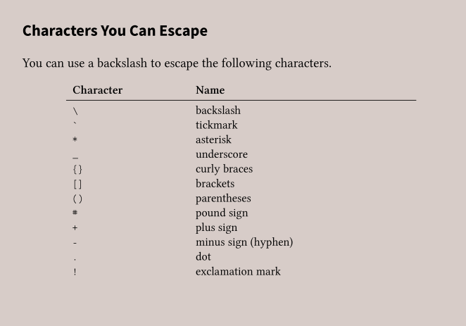

- [References](#references)
- [Introduction](#introduction)
  - [What is Markdown?](#what-is-markdown)
  - [How Markdown Works](#how-markdown-works)
- [Syntax](#syntax)
  - [Headings](#headings)
    - [Alternate Syntax](#alternate-syntax)
  - [Paragraphs](#paragraphs)
  - [Line Breaks](#line-breaks)
  - [Bold Text](#bold-text)
  - [Italic Text](#italic-text)
  - [Bold and Italic Text](#bold-and-italic-text)
  - [Blockquotes](#blockquotes)
  - [Lists](#lists)
    - [Ordered Lists](#ordered-lists)
  - [Unordered List](#unordered-list)
    - [Nesting Other Elements in Unordered Lists](#nesting-other-elements-in-unordered-lists)
  - [Code](#code)
    - [Escaping Tick Marks](#escaping-tick-marks)
  - [Code Blocks](#code-blocks)
  - [Horizontal Rules](#horizontal-rules)
  - [Links](#links)
    - [Reference-style links](#reference-style-links)
      - [Formatting First Part of Link](#formatting-first-part-of-link)
      - [Formatting Second Part of Link](#formatting-second-part-of-link)
  - [Images](#images)
  - [Escaping Characters](#escaping-characters)
- [Extended Syntax](#extended-syntax)
  - [Tables](#tables)
    - [Alignment of text in tables](#alignment-of-text-in-tables)
    - [Formatting Text in Tables](#formatting-text-in-tables)
  - [Fenced Code Blocks](#fenced-code-blocks)
    - [Syntax Highlighting](#syntax-highlighting)
  - [Footnotes](#footnotes)
    - [Footnote reference](#footnote-reference)
    - [Footnote content](#footnote-content)
  - [Heading IDs](#heading-ids)
  - [Definition Lists](#definition-lists)
  - [Strikethrough](#strikethrough)
  - [Task Lists](#task-lists)
  - [Automatic URL Linking](#automatic-url-linking)
    - [Disabling Automatic URL Linking](#disabling-automatic-url-linking)

# References
> The Markdown Guide by Matt Cone

# Introduction
Can be used to create documents, books and technical documentation.

## What is Markdown?  
Markdown is a lightweight markup language used to add formatting elements to plaintext text documents. It was created by John Gruber in 2004.

You can write Markdown using any text editor or any dedicated Markdown application,

MArkdown is designed to be readable and unobtrusive. 


## How Markdown Works  
When you write in Markdown, the text is stored in plaintext file with a `.md ` or `.markdown` extension.

Markdown applications use something called a *Markdown processor* (also known as a *parser* or *implementation*) to convert Markdown-formatted text to HTML format output.  
The document can be viewed in a web browser or combined with a style sheet and printed.

# Syntax

You can add HTML tags to a Markdown file, if you prefer certain HTML tags to the Markdown syntax.


## Headings

```
# Heading level 1
## Heading Level 2
### Heading Level 3
#### Heading Level 4
##### Heading Level 5
###### Heading Level 6

```

<h1>Heading Level 1</h1>
<h2>Heading Level 2</h2>
<h3>Heading Level 3</h3>
<h4>Heading Level 4</h4>
<h5>Heading Level 5</h5>
<h6>Heading Level 6</h6>

### Alternate Syntax
```html
Heading level 1
===

Heading Level 2
---
```

<h1>Heading Level 1</h1>
<h2>Heading Level 2</h2>

## Paragraphs  
Use a blank line to separate lines of text.

```
I really like using Markdown.

I think I'll use it from now on.
```

I really like using Markdown.

I think I'll use it from now on.


## Line Breaks
To create a line break, end a line with two or more spaces

```
This is the first line.  
This is the second line.
```

This is the first line.  
This is the second line.

## Bold Text
Add two asterisks or underscores before and after a word or phrase.

```
I love **bold text**

I love __bold text__
```

I love **bold text**

I love __bold text__

## Italic Text

Add one asterisk or underscore before and after a word or phrase.

```
I like *italic text*

I like _italic text_
```

I like *italic text*

I like _italic text_


## Bold and Italic Text

Add three asterisks or underscores before and after a word or phrase.

```
***Important*** text

___Important___ text

__*Important*__ text

**_Important_** text
```

***Important*** text

___Important___ text

__*Important*__ text

**_Important_** text


## Blockquotes

Add a `>` in front of a paragraph

```
> The Markdown Guide by Matt Cone
```

> The Markdown Guide by Matt Cone


For a **blockquote with multiple paragraphs**, add a `>` on the blank lines between the paragraphs

```
> This is the first paragraph.
>
> This is the second paragraph.
```

> This is the first paragraph.
>
> This is the second paragraph.


To **nest a blockquote**, add a `>>` in front of the paragraph you want to nest.

```
> This is the first paragraph.
>
>> This is the nested paragraph.
```

> This is the first paragraph.
>
>> This is the nested paragraph.


**Note**: Blockquotes can contain other Markdown formatted elements, but not all.

## Lists

### Ordered Lists
Add numbers with periods in front of the list item. The numbers don't have to be in numerical order, but the list should start with the number one.

```
1. First item
2. Second item
3. Third Item
4. Fourth Item

1. First item
8. Second item
3. Third item
5. Fourth item
```

1. First item
8. Second item
3. Third item
5. Fourth item


To **nest list items in an ordered list**, indent the items four spaces or one tab
```
1. First item
2. Second item
3. Third item
    1. Indented item
    2. Indented item
```
1. First item
2. Second item
3. Third item
    1. Indented item
    2. Indented item


## Unordered List
Add dashes `-`, asterisks`*` or plus signs`+` in front of list items

```
- First item
- Second item
- Third item
- Fourth item

+ First item
+ Second item
+ Third item
+ Fourth item

* First item
* Second item
* Third item
* Fourth item

- First item
+ Second item
* Third item
- Fourth item
```

- First item
+ Second item
* Third item
- Fourth item


To **nest list items in an unordered list**, indent the items four spaces or one tab

```
- First item
+ Second item
* Third item
    - Indented item
    - Indented item
```

- First item
+ Second item
* Third item
    - Indented item
    - Indented item

### Nesting Other Elements in Unordered Lists

**Note**: You can add other elements, like a paragraph, blockquote or code block to an unordered list.

**Nested Paragraph in List**
```
* This is the first list item.
* Here's the second list item.

I need to add another paragraph below the second list item.

* And here's the third list item
```
* This is the first list item.
* Here's the second list item.

I need to add another paragraph below the second list item.

* And here's the third list item

**Nested Blockquote in list**
```
* This is the first list item.
* Here's the second list item.

> A blockquote would look great here.

* And here's the third list item.
```

* This is the first list item.
* Here's the second list item.

> A blockquote would look great here.

* And here's the third list item.


**Nested Code Blocks in List** - Indent 8 spaces or two tabs.
```
1. Open the file.

2. Find the following code block on line 21:

        <html>
          <head>
          <title>Test</title>
          </head>

3. Update the title to match the name of your website.
```

**Nested Images in List**
```
1. Open the file containing Tux, the Linux mascot.
2. Marvel at its beauty.

  

3. Close the file.
```

1. Open the file containing Tux, the Linux mascot.
2. Marvel at its beauty.

  

3. Close the file.


## Code
To denote a word or phrase as code, enclose it in tick marks (`)

```
At the command prompt, type `nano`
```

At the command prompt, type `nano`

### Escaping Tick Marks
If the word or phrase you want to show as code includes tick marks, you can escape it by using double tick marks(``)
```
``Use `code` in your Markdown file.``
```
``Use `code` in your Markdown file.``


## Code Blocks
Indent every line or block at least four spaces or one tab

```
    <html>
      <head>
      </head>
    </html>
```

    <html>
      <head>
      </head>
    </html>

## Horizontal Rules
Use three or more asterisks, dashes or underscores on a line by themselves

```
***

---

___
```
***

---

___


## Links
Enclose the link text in brackets and follow it immediately by the URL in parentheses. There should be no space between the brackets and the parentheses.  
You can also add a title for the link. It will appear as a tooltip when the link is hovered over. To add a link title, enclose it the parentheses after the URL. It will be in quotation marks.


```
Use [Duck Duck Go](https://duckduckgo.com)
Use [Duck Duck Go](https://duckduckgo.com "My Search Engine")
```
Use [Duck Duck Go](https://duckduckgo.com)

Use [Duck Duck Go](https://duckduckgo.com "My Search Engine")


To quickly turn a URL or email address into a link, enclose it in angle brackets

```
<https://eff.org>

<fake@example.com>
```
<https://eff.org>

<fake@example.com>

**Note**: Links can be emphasized - made bold or italicized by adding asterisks before and after the brackets and parentheses,

### Reference-style links

#### Formatting First Part of Link
```
[hobbit-hole][1] - the reference
```

#### Formatting Second Part of Link
```
[hobbit-hole]: https://en.wikipedia.org - place referred to
```
**Example**:
The full [passage][1] is available on Wikipedia.

[1]: https://en.wikipedia.org


## Images
```


```


## Escaping Characters
Use a backlash in front of the character to be escaped.

```
\* Without the backlash, this would be a bullet in an unordered list.
```
\* Without the backlash, this would be a bullet in an unordered list.




# Extended Syntax
Other lightweight Markup languages exist, and are supersets of Markdown.
1. CommonMark
2. GitHub Flavored Markdown
3. Markdown Extra
4. MultiMarkdown


## Tables
Use three or more hyphens (---) to create column headers, and pipes (|) to separate each column.

```
| Syntax    | Description |
| --------- | ----------- |
| Header    | Title       |
| Paragraph | Text        |
```

| Syntax    | Description |
| --------- | ----------- |
| Header    | Title       |
| Paragraph | Text        |

**Note**: An easier way to create tables in Markdown is by using the [Markdown Tables Generator](http://www.tablesgenerator.com/markdown_tables). It has a graphical interface.

### Alignment of text in tables

* Left align - Add a colon to the left of the hyphens
* Right align - Add a colon to the right of the hyphens
* Center align - Add a colon on either side of the hyphens

```
| Syntax    | Description |   Test Text |
| :-------- | :---------: | ----------: |
| Header    |    Title    | Here's this |
| Paragraph |    Text     |    And more |
```
| Syntax    | Description |   Test Text |
| :-------- | :---------: | ----------: |
| Header    |    Title    | Here's this |
| Paragraph |    Text     |    And more |

### Formatting Text in Tables
You can format text and add links and code only. 

You cannot add code blocks, emphasis(bold or italic text), headings, blockquotes, lists, horizontal rules, images, or HTML tags.

To escape pipe characters in tables, use its character code instead (&#124;).

## Fenced Code Blocks
Use three tick marks (```) or three tildes (~~~) on the lines before and after the code block.

```
\```
"firstName": "John",
"lastName": "Smith",
"age": 25
\```
```

```
"firstName": "John",
"lastName": "Smith",
"age": 25
```

### Syntax Highlighting
Many Markdown processors allow color highlighting for whatever language your code is written in.

To add syntax highlighting, specify a language next to the tick marks or tildes before the fenced code block.

```
\```json
"firstName": "John",
"lastName": "Smith",
"age": 25
\```
```

```json
"firstName": "John",
"lastName": "Smith",
"age": 25
```

## Footnotes
### Footnote reference
Add a caret and an identifier ([^1]) inside brackets. Identifiers can be words, numbers or just alphabets. They can't contain spaces or tabs. In the output, footnotes are numbered sequentially.


### Footnote content
Add footnote using another caret and number inside brackets with a colon and text ([^1]: My footnote)

```
Here's a simple footnote,[^1] and here's a longer one.[^bignote]

[^1]: This is the first footnote.

[^bignote]: Here's one with multiple paragraphs and code.

            Indent paragraphs to include them in the footnote.
            `{my code}`
            Add as many paragraphs as you like.
```

Here's a simple footnote,[^1] and here's a longer one.[^bignote]

[^1]: This is the first footnote.

[^bignote]: Here's one with multiple paragraphs and code.

  Indent paragraphs to include them in the footnote.
  `{my code}`
  Add as many paragraphs as you like.


## Heading IDs
To add custom heading IDs, enclose the custom ID in curly braces on the same line as the heading.

```
# A heading {#custom-id}
```


To link to heading ID
```
[Heading ID](#heading-id)
```

## Definition Lists
```
First Term
: This is the definition of the first term.

Second term
: This is one definition of the second term
: This is another definition of the second term
```
First Term
: This is the definition of the first term.

Second term
: This is one definition of the second term  
: This is another definition of the second term

## Strikethrough
Use two tilde symbols before the word(s).

```
The world is ~~flat~~ round
```

The world is ~~flat~~ round


## Task Lists
To create a task list, add a dash and an empty bracket followed by a space in front of task list items.  
To select a checkbox, add an `x` between the brackets.

```
- [x] Write the press release
- [ ] Update the website
- [ ] Contact the media
```

- [x] Write the press release
- [ ] Update the website
- [ ] Contact the media

## Automatic URL Linking
Many Markdown processors automatically turn URLs into links.

```
http://example.com
```

http://example.com

### Disabling Automatic URL Linking
To disable it, denote the link as code
```
http://example.com
```
`http://example.com`


