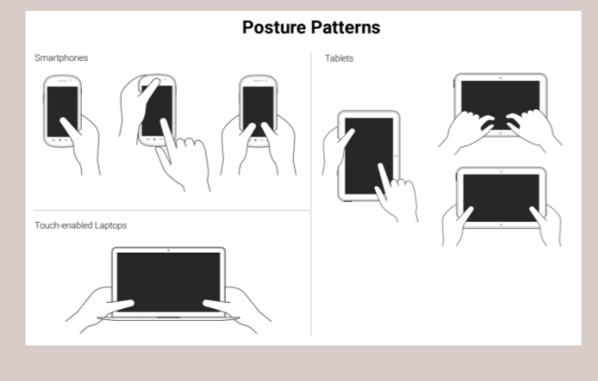
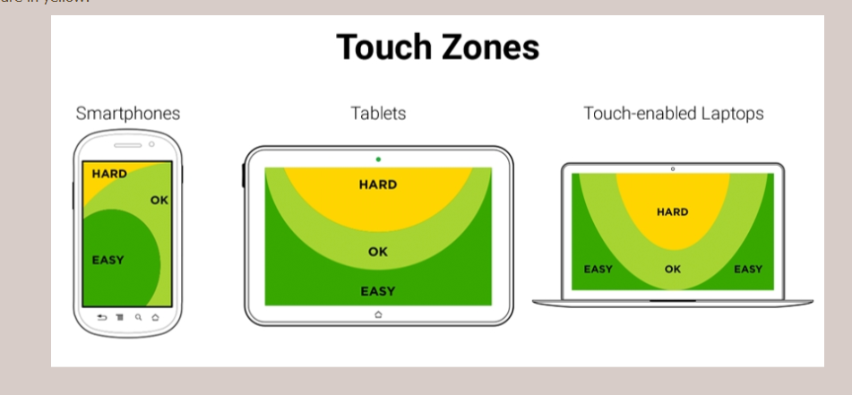

# Table of Contents
- [Table of Contents](#table-of-contents)
- [References](#references)
- [Introduction](#introduction)
- [What to Consider](#what-to-consider)
- [Responsive Layout](#responsive-layout)
  - [Layout Options](#layout-options)
  - [Flexible Grids](#flexible-grids)
- [Responsive Content](#responsive-content)
  - [Content Strategy](#content-strategy)
  - [Viewports](#viewports)
    - [Pixels](#pixels)
    - [Viewport meta tag](#viewport-meta-tag)
  - [Responsive Typography](#responsive-typography)
    - [Sizing Fonts](#sizing-fonts)
  - [Responsive Images](#responsive-images)
  - [Responsive Navigation](#responsive-navigation)
- [Responsive Workflow](#responsive-workflow)
  - [Content](#content)
- [Media Queries](#media-queries)
  - [Components of Media Queries](#components-of-media-queries)
    - [Media Types](#media-types)
  - [Logical Keywords for Media Queries](#logical-keywords-for-media-queries)
    - [Media Features (What can Be Queried)](#media-features-what-can-be-queried)
  - [Ways to Use Media Queries](#ways-to-use-media-queries)
  - [Breakpoints and Design Ranges](#breakpoints-and-design-ranges)
    - [Determining Breakpoints](#determining-breakpoints)
- [Designing for Touch](#designing-for-touch)
  - [Ideal Target Sizes for small UIs](#ideal-target-sizes-for-small-uis)
  - [Posture Patterns and Touch Zones](#posture-patterns-and-touch-zones)
- [Responsive Emails](#responsive-emails)
- [Progressive Enhancement](#progressive-enhancement)


# References
> **Learning Responsive Web Design** by *Clarissa Peterson*
> 
> **Implementing Responsive Design** by *Tim Kadlec*   
> 
> **Adaptive Web Design** by *Aaron Gustafson*
> 
> **Head First Mobile Web** by *Lyza Danger Gardner and Jason Grigsby* (minor details)

# Introduction
Responsive web design is a way to make websites that can be easily viewed and used on any type of device and size of screen.

# What to Consider
1. Type of device: smartphone, laptop, tablet. TV, refrigerator, ebook reader, tts
2. Device capabilities: Do you need access to the phone's location, camera, gyroscope, etc?
3. Display size
4. Hardware performance: CPU speed,memory, if CSS effects are hardware accelerated
5. Network/Connection speed: Fast or slow connection? Determines if site is media-heavy
6. Browser features: Does it support cookies, HTTPS, video playback, etc?
7. Standards support
8. Input method
9. Context: How and where the device is used - the time of day, around friends or strangers, at home, while walking, in transit
10. Js or CSS functionality
11. Accessibility for disabled  people - color blindness, blindness, 
12. Does the service need to be used offline?
13. Audience usage: What devices are your customers likely to use?
14. 

# Responsive Layout
## Layout Options
1. Fixed-width Layout  
    Site width is constrained to a specific pixel measurement, usually 960px.
2. Fluid Layout  
    Dimensions are determined by percentages.
3. Elastic layout  
    Constraints are determined by type size, typically using the `em` measurement.
4. Hybrid layout  
    Combines two or more layouts.
## Flexible Grids

# Responsive Content
## Content Strategy
When redesigning, do a content audit - going through the site examining the content before designing.

Use the inverted pyramid, putting the most important information first.

Make use of headings for particularly long content to split them into sections.

## Viewports
The viewport is the visible area of the browser; the browser width.

1. The layout viewport  
    Similar to device pixels; measurements are always the same regardless of orientation or zoom level.

2. The visual viewport  
    Part of page shown on screen at any given point.

### Pixels
Device Pixels are the pixels on the device screen

CSS Pixels deal with the visible area within the browser window. It can change on devices with high-resolution display.

### Viewport meta tag
Lets you control the scaling and layout viewport of many devices
1. The `width` directive  
    Lets you set the viewport to a specific width. Can be a fixed width.
    ```html
    <meta name="viewport" content="width=device-width">
    ```

2. The `height` directive   
    Lets you set the viewport to a specific height. Can be a fixed height.  
    Useful if you don't want the page to scroll vertically.
    ```html
    <meta name="viewport" content="height=device-height">
    ```

3. The `user-scalable` directive  
    Tells the browser if the user can zoom in and out on the page.
    ```html
    <!--Prevents zooming-->
    <meta name="viewport" content="user-scalable=no">
    ```

4. The `initial-scale` directive  
    Scale between 0.1(10%) and 10.0(1000%). It sets the initial zoom level of the page.
    ```html
    <!--1:1 Scaling-->
    <meta name="viewport" content="initial-scale=1" width="device-width">

    <!--2:1 Scaling-->
    <meta name="viewport" content="initial-scale=.5" width="device-width">
    ```

5. The `maximum-scale` directive  
    Scale between 0.1(10%) and 10.0(1000%). Tells the browser how far the user can zoom in on a page.  
    At `1.0`, you disable the user's ability to zoom in.

6. The `minimum-scale` directive  
    Scale between 0.1(10%) and 10.0(1000%). Tells the browser how far the user can zoom out on a page.  
    At `1.0`, you disable the user's ability to zoom out.

## Responsive Typography
### Sizing Fonts
1. Using `ems`
    ```scss
    body {
      font-size: 100%;//Often 16px
    }

    h1 {font-size: 1.5em;}
    span {font-size: 0.5em;}
    ```


## Responsive Images
```css
img {max-width: 100%;}
```

Using the `srcset` attribute with the `` tag to swap out images. The browser only downloads the file it needs.
```html

```
* Default image: `flower.jpg`
* For high-density screens(pixel density of 2 or greater): `flower-HD.jpg`
* Narrow screens < 600px wide: `flower-small.jpg`
* Screens < 600px and high density: `flower-small-HD.jpg`


Using the `srcset` attribute with the `<picture>` tag to swap out images. The browser only downloads the file it needs.
```html
<picture>
  <source media="(min-width:45em)" src="images/flower-large.jpg"> //45ems or wider
  <source media="(min-width: 18em)" src="images/flower-medium.jpg"> //18ems or wider, but less than 45ems   
  <source src="flower-small.jpg"> //All other viewports
  
</picture>
```

You can combine the `<picture>` element with the `srcset` attribute if you want to use both viewport media queries and versions with different resolutions
```html
<picture>
  <source media="(min-width:45em)" srcset="flower-large.jpg 1x, flower-large-hd.jpg 2x"> //45ems or wider
  <source media="(min-width: 18em)" srcset="flower-medium.jpg 1x, flower-medium.jpg 2x">  //18ems or wider, but less than 45ems
  <source srcset="flower-small.jpg 1x. flower-small-hd.jpg 2x"> //All other viewports
  
</picture>
```

Another solution would be to use
1. Polyfills such as Picturefill, Adaptive Images, HiSRC, 
2. Third-party services such as ReSRC, Thumbr.io, Responsive.io

## Responsive Navigation
1. It shouldn't take up precious screen real estate
2. Should be intuitive so the user isn't disoriented or confused
3. Should be usable by a wide variety of devices, though experience may differ
4. 

# Responsive Workflow
## Content
The content is the most important part of the website. Build the design around the content.

Use a style guide; a document to collate all the design decisions made for the site.
It also documents design decisions for the future maintainer of the site, and helps maintain a website's design identity over time.
1. What colors are used?
2. What typefaces are used, and where?
3. The correct font sizes
4. What the buttons look like?
5. Layout system/grid
6. Styles for elements e.g list items, form elements, blockquotes, etc
7. Logo usage

A good example to start is the [Style Guide Boilerplate](http://brettjankord.com/projects/style-guide-boilerplate/)

# Media Queries

## Components of Media Queries
The general form of a media query: 
```css
@media [not/only] type [and] (expr) {Rules}
```
1. Media type: Specifies the type of device to target
2. Media expressions test against a feature and evaluate to either true or false
3. Logical keywords let you create more complex expressions
4. Rules

### Media Types
1. **all** - applies to every type of device
2. braille
3. embossed
4. handheld
5. **print** styles apply only when page is printed/
6. projection
7. **screen** refers to styles displayed only on a monitor.
8. speech
9. tty - media using a fixed-pitch character grid (terminals or teletypes)
10. tv


## Logical Keywords for Media Queries
1. `and`:
    ```
    @media screen and (color) {...}
    @media screen and (max-width:) {...}
    ```
2. `not`: Negates everything after it
    ```
    @media not screen and (color) {...}
    ```
3. `or`: There is no `or` keyword but the comma acts as one
    ```
    @media screen and (color), projection and (color)
    ```
4. `only`
    ```
    @media 0nly screen and (color)
    ```

### Media Features (What can Be Queried)
1. viewport/device width and height  
```css
//For viewport
@media only screen and (min-width: 40em){...}
@media only screen and (height: 60em){...}

//For device
@media only screen and (max-device-width: 40em){...}
```

2. Orientation  
`Landscape` or `portrait`
```css
@media only screen and (orientation: landscape){...}
```

3. Aspect ratio  
`aspect-ratio`: ratio of viewport
`device-aspect-ratio`: ratio of device screen
```css
@media only screen and (device-aspect-ratio: 16/9){...}
@media only screen and (min-device-aspect-ratio: 1920/1080){...}
```

4. Resolution  
```css
@media only screen and (min-resolution: 300dpi){...}
```
5. `color`: number of bits per color component of the output device. The word `color` on its own asks if the device has a color screen or not.
6. `color-index`: number of entries in the color lookup table of the device e.g 256
7. `monochrome`
8. `scan`: whether device uses progressive scan. Only applies to Tvs.
9. `grid`: Checks if the output is grid-based (such as teletype or TTY, with a fixed font) or bitmap(a screen with pixels).


## Ways to Use Media Queries
1. Linking Stylesheets for Media Queries
```html
<link rel="stylesheet" href="styles.css">
<link rel="stylesheet" href="print.css" media="print"> //For just print
<link rel="stylesheet" href="styles.css" media="only screen and (min-width: 1300px)">
```
2. They can be placed in the main stylesheet.

3. Using Media Queries with Attributes
A media query can be used as an attribute to the `<style>` element in the `<head>` of a page
```html
<style media="only screen and (min-width: 40em)">
...
</style>
```

## Breakpoints and Design Ranges
A breakpoint is the point at which you can use a media query to change the design.

Design range is the range of screen sizes on either side of the line. Each design range gets a different variation of the design.

The important thing is how a design look across each design range, not how it looks at each breakpoint.

### Determining Breakpoints
1. Follow the content  
    Decide by resizing your browser and seeing how the content changes.
2. Enhance for larger screens  
    For readability. Consider using the multi-column layout.
3. Use `ems` for more flexible media queries

# Designing for Touch
## Ideal Target Sizes for small UIs
The target size should be big enough to avoid accidental taps. The smaller the target, the longer the user will take to reach it.

The average width of an adult's index finger is about *16mm to 20mm*. Close to *45px to 75px*.  According to Apple's iOS Human INterface Guidelines, the recommended target size is *44pt x 44pt*

## Posture Patterns and Touch Zones
**Posture Patterns** allow us define the best way to lay out content in order to be easily usable and accessible.


**Touch Zones** are the areas of a device that are easy or hard to reach, depending on the posture.


# Responsive Emails
1. Define the email client that has the least CSS and HTML support
2. Use progressive enhancement
3. Stay within a width of 550 to 600px: Most email clients have narrow preview panes, and the email will look good on desktop clients and web browsers, and will remain readable when scaled down.
4. Use tables for layout
5. Use inline CSS because many email clients remove the `<head>` section of the email.
6. Use system fonts
7. Provide a fallback color for background images
8. Always use the `alt` attribute on images
9. Use the HTML5 doctype
10. Avoid using HTML5 elements
11. Keep it simple: Most emails have a very short lifespan so an intricate layout is not necessary.


# Progressive Enhancement
Starting with the basics, and adding on from there for browsers and devices that can handle more.  
Building for the less-capable browsers first. 

Progressive enhancement relies on fault tolerance; the system's ability to continue to operate when it encounters an unexpected error.

1. Default Layer: Build for the narrowest devices and the most basic devices - devices that may not be able to recognize media queries, CSS3 or JS. Use semantic markup and structure, and focus on presenting the content in a clean, usable form.
2. Presentation Layer: Use CSS to determine how everything will look on the page - layout, color, typography, etc.
3. Behaviour layer: Try to make sure basic site functionality will work without JS. Add JS.